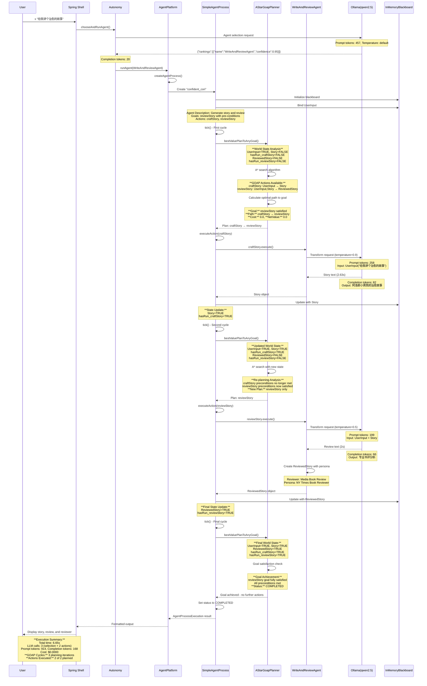

# Hello Embabel


&nbsp;&nbsp;&nbsp;&nbsp;

&nbsp;&nbsp;&nbsp;&nbsp;

一个展示 [Embabel 框架](https://github.com/embabel/embabel-agent) AI 代理开发的多语言示例项目。

本项目包含 Java 和 Kotlin 两个版本的实现，演示如何使用 Embabel 框架构建智能代理。

## 📋 项目结构

```
hello-embabel/
├── java/           # Java 版本实现
│   ├── src/
│   ├── pom.xml
│   └── README.md
├── kotlin/         # Kotlin 版本实现
│   ├── src/
│   ├── pom.xml
│   └── README.md
├── .gitmodules     # Git 子模块配置
└── README.md       # 项目说明文档
```

## 🚀 快速开始

如果已经克隆了项目但没有子模块：

```bash
git submodule update --init --recursive
```

### 更新子模块

如果需要将子模块更新到最新版本：

```bash
# 更新所有子模块到最新提交
git submodule update --remote --recursive

# 或者手动进入子模块目录更新
cd java
git pull origin main
cd ../kotlin  
git pull origin main
cd ..

# 提交子模块更新
git add .
git commit -m "Update submodules to latest version"
```

### 运行 Java 版本

```bash
cd java
mvn spring-boot:run
```

### 运行 Kotlin 版本

```bash
cd kotlin
mvn spring-boot:run
```

## 💡 使用示例

启动应用后，您可以通过以下方式使用：

### Shell 模式 (传统方式)

在 Embabel Shell 中使用以下命令：

```bash
# 创作一个故事
x "Tell me a story about a brave knight"

# 中文示例
x "给我讲一个关于勇敢骑士的故事"
```

### Web API 模式 (开发中) 🚧

**注意**: Web API 当前处于开发阶段，缺少 Embabel Autonomy 集成，无法提供完整的 GOAP 工作流程。

#### 使用 Web 界面

启动应用后，打开浏览器访问：`http://localhost:8080`

#### 使用 REST API

```bash
curl -X POST http://localhost:8080/api/agent/execute \
  -H "Content-Type: application/json" \
  -d '{
    "userInput": "给我讲一个关于勇敢骑士的故事"
  }'
```

#### API 端点

- `POST /api/agent/execute` - 执行故事生成 (⚠️ 当前返回错误，等待 Embabel 集成)
- `GET /api/agent/health` - 检查服务状态
- `GET /api/agent/info` - 获取代理信息

#### 当前限制

Web API 版本当前无法执行完整的工作流程，因为：

1. 缺少 `Autonomy.chooseAndRunAgent()` API 集成
2. 无法进行动态 Agent 选择
3. 不支持 GOAP 规划和执行

要体验完整的 Embabel GOAP 功能，请使用 Shell 模式。

## 🔄 完整工作流程

下图展示了从系统启动到故事生成的完整端到端工作流程，揭示了真实的 GOAP 执行机制：

**注意**：当前 Web API 版本尚未完全实现此工作流程。Shell 版本完整支持此流程，Web API 版本需要 Embabel Autonomy 集成才能实现相同的执行路径。



## 🔑 核心特性

### Shell 模式（完整功能）

- **GOAP 动态规划**: 基于当前世界状态规划和重新规划行动
- **多人格 LLM**: 针对创意和分析任务使用不同的人格和温度参数
- **自动代理选择**: 根据用户输入选择合适的代理
- **状态管理**: 在整个工作流程中跟踪执行状态和可用对象
- **工具集成**: 可扩展的工具系统，注册了 6 个工具组

### Web API 模式（开发中）

- **Web API 支持**: 🆕 提供 RESTful API 接口
- **双模式运行**: 支持传统 Shell 模式和现代 Web API 模式
- **实时 Web 界面**: 🆕 包含用户友好的 Web 界面，无需命令行操作
- **⚠️ 限制**: 当前缺少 Embabel Autonomy 集成，无法实现完整的 GOAP 工作流程

### 实现状态对比

| 功能           | Shell 模式    | Web API 模式         |
| -------------- | ------------- | -------------------- |
| Agent 自动选择 | ✅ 完整支持   | ❌ 待实现            |
| GOAP 规划执行  | ✅ 完整支持   | ❌ 待实现            |
| LLM 集成       | ✅ 完整支持   | ❌ 待实现            |
| 用户接口       | ✅ Shell 命令 | ✅ REST API + Web UI |

**总结**: Shell 模式提供完整的 Embabel GOAP 体验，Web API 模式目前仅提供接口框架，等待 Embabel Autonomy API 集成。

## 📖 详细文档

- [Web API 使用指南](web-api-readme.md) - 详细的 Web API 功能说明
