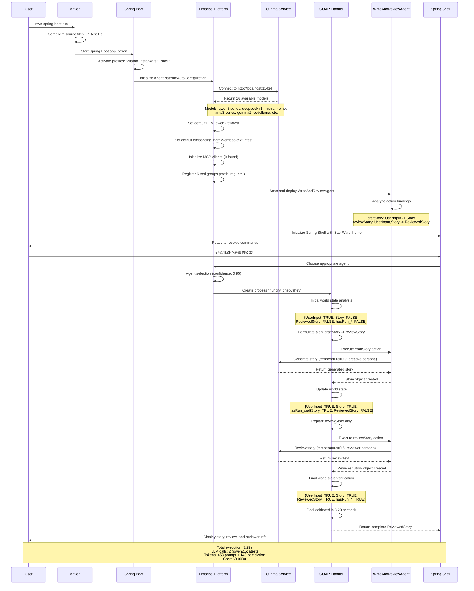

# Hello Embabel


&nbsp;&nbsp;&nbsp;&nbsp;

&nbsp;&nbsp;&nbsp;&nbsp;

一个展示 [Embabel 框架](https://github.com/embabel/embabel-agent) AI 代理开发的多语言示例项目。

本项目包含 Java 和 Kotlin 两个版本的实现，演示如何使用 Embabel 框架构建智能代理。

## 📋 项目结构

```
hello-embabel/
├── java/           # Java 版本实现
│   ├── src/
│   ├── pom.xml
│   └── README.md
├── kotlin/         # Kotlin 版本实现
│   ├── src/
│   ├── pom.xml
│   └── README.md
├── .gitmodules     # Git 子模块配置
└── README.md       # 项目说明文档
```

## 🚀 快速开始
如果已经克隆了项目但没有子模块：
```bash
git submodule update --init --recursive
```

### 运行 Java 版本

```bash
cd java
mvn spring-boot:run
```

### 运行 Kotlin 版本

```bash
cd kotlin
mvn spring-boot:run
```

## 💡 使用示例

启动应用后，在 Embabel Shell 中使用以下命令：

```bash
# 创作一个故事
x "Tell me a story about a brave knight"

# 中文示例
x "给我讲一个关于勇敢骑士的故事"
```

## 🔄 完整工作流程

下图展示了从系统启动到故事生成的完整端到端工作流程，使用 GOAP 动态规划：



### 🔑 核心特性

- **GOAP 动态规划**: 基于当前世界状态规划和重新规划行动
- **多人格 LLM**: 针对创意和分析任务使用不同的人格和温度参数
- **自动代理选择**: 根据用户输入选择合适的代理
- **状态管理**: 在整个工作流程中跟踪执行状态和可用对象
- **工具集成**: 可扩展的工具系统，注册了 6 个工具组

## 🔧 配置

### LLM 模型配置

编辑 `src/main/resources/application.properties` 文件：

```properties
# 激活配置文件
spring.profiles.active=ollama,shell,starwars

# Ollama 配置
spring.ai.ollama.base-url=http://localhost:11434

# 模型配置
embabel.models.default-llm=qwen2.5
embabel.models.default-embedding-model=nomic-embed-text:latest

# 故事配置
storyWordCount=100
reviewWordCount=100
```