# AStarGoapPlanner.planToGoalFrom 方法详细分析

## 概述

`AStarGoapPlanner` 实现了基于 A* 算法的目标导向行动规划（GOAP - Goal-Oriented Action Planning）系统。该系统通过寻找最优的行动序列，将初始世界状态转换为满足目标的状态，同时最小化总成本。

## 核心概念

### 领域模型

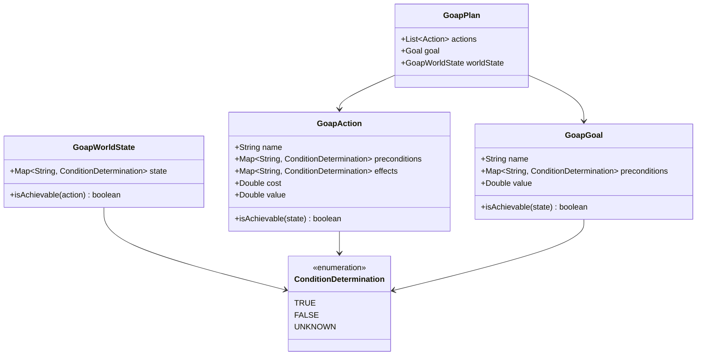

### A* 算法关键要素

- **g-score**: 从起始状态到当前状态的实际累积成本
- **h-score**: 从当前状态到目标状态的启发式估计成本
- **f-score**: g-score + h-score，表示通过当前状态到达目标的总估计成本

## planToGoalFrom 方法执行流程

### 主流程图

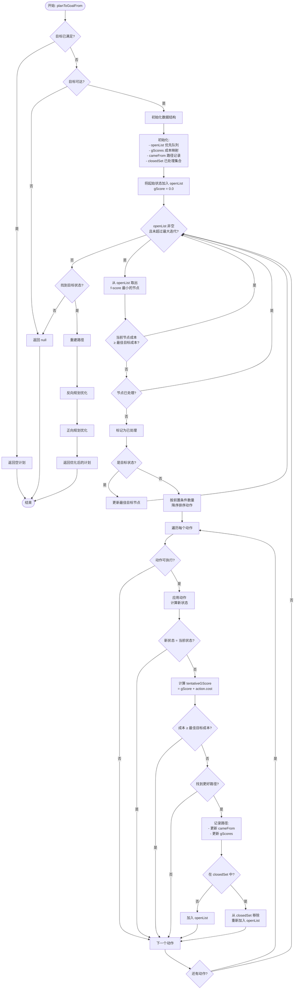

### 详细步骤说明

#### 1. 快速检查阶段

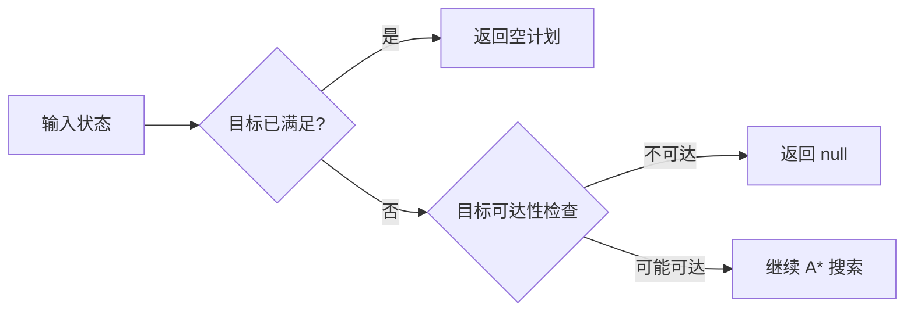

**代码实现**:
```kotlin
// 快速检查：如果目标已满足，返回空计划
if (goal.isAchievable(startState)) {
    return GoapPlan(emptyList(), goal, worldState = startState)
}

// 早期可达性检查，避免对不可达目标进行昂贵的 A* 搜索
if (!isGoalReachable(startState, actions, goal)) {
    return null
}
```

**目标可达性检查原理**:
- 构建所有动作可产生的效果集合
- 检查目标的每个前置条件
- 如果某个前置条件在起始状态中未满足，且没有任何动作能产生该效果，则目标不可达

#### 2. 数据结构初始化

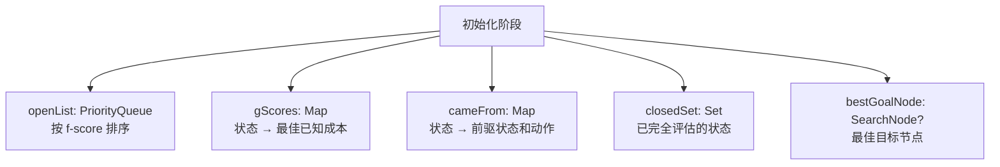

**代码实现**:
```kotlin
val openList = PriorityQueue<SearchNode>()
val gScores = mutableMapOf<GoapWorldState, Double>().withDefault { Double.MAX_VALUE }
val cameFrom = mutableMapOf<GoapWorldState, Pair<GoapWorldState, GoapAction?>>()
val closedSet = mutableSetOf<GoapWorldState>()

gScores[startState] = 0.0
openList.add(SearchNode(startState, 0.0, heuristic(startState, goal)))
```

#### 3. A* 主循环

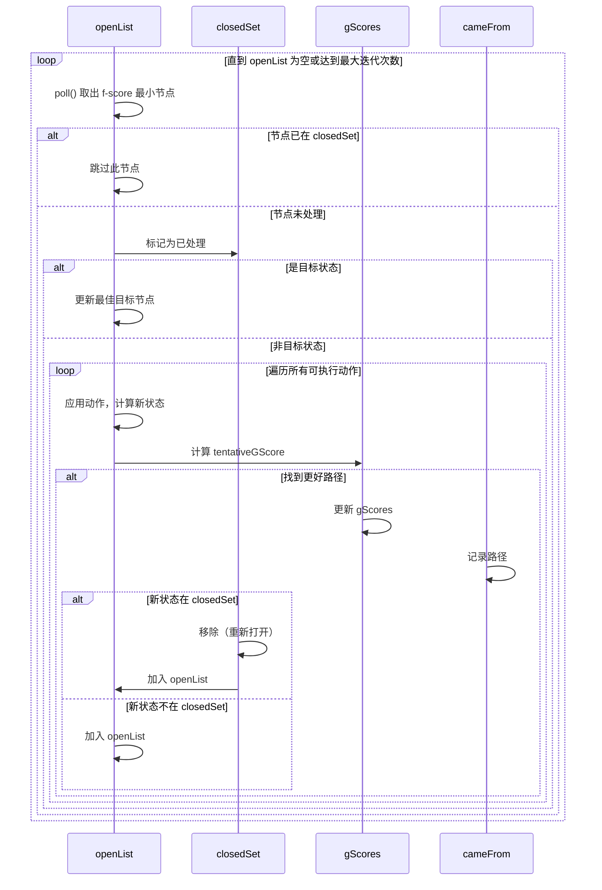

**关键优化点**:

1. **动作排序**: 按前置条件数量降序排序，优先考虑更具体的动作
```kotlin
val sortedActions = actions.sortedByDescending { it.preconditions.size }
```

2. **状态变化检查**: 跳过不改变状态的动作，防止循环
```kotlin
if (nextState == current.state) continue
```

3. **成本剪枝**: 如果路径成本已超过最佳目标成本，跳过
```kotlin
if (bestGoalNode != null && tentativeGScore >= bestGoalScore) {
    continue
}
```

4. **重新打开节点**: 如果找到到达已关闭节点的更好路径，重新打开它
```kotlin
if (nextState !in closedSet) {
    openList.add(SearchNode(nextState, tentativeGScore, heuristic(nextState, goal)))
} else {
    closedSet.remove(nextState)
    openList.add(SearchNode(nextState, tentativeGScore, heuristic(nextState, goal)))
}
```

#### 4. 启发式函数

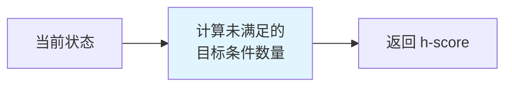

**代码实现**:
```kotlin
private fun heuristic(state: GoapWorldState, goal: GoapGoal): Double {
    return goal.preconditions.count { (key, value) -> 
        state.state[key] != value 
    }.toDouble()
}
```

**特性**:
- **可采纳性**: 永不高估实际成本，确保 A* 找到最优路径
- **简单高效**: 仅计数未满足条件，计算复杂度 O(n)

#### 5. 路径重建

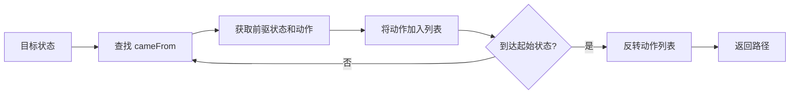

**代码实现**:
```kotlin
private fun reconstructPath(
    cameFrom: Map<GoapWorldState, Pair<GoapWorldState, GoapAction?>>,
    goalState: GoapWorldState
): List<GoapAction> {
    val actions = mutableListOf<GoapAction>()
    var currentState = goalState
    
    while (currentState in cameFrom) {
        val (previousState, action) = cameFrom[currentState]!!
        if (action != null) {
            actions.add(action)
        }
        currentState = previousState
    }
    
    return actions.reversed()
}
```

#### 6. 计划优化

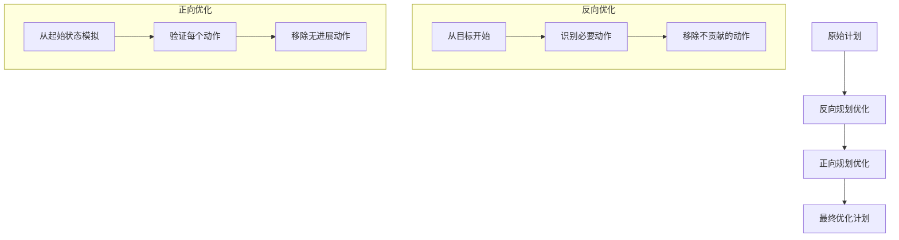

##### 反向规划优化

**原理**: 从目标反向工作，只保留对实现目标有贡献的动作

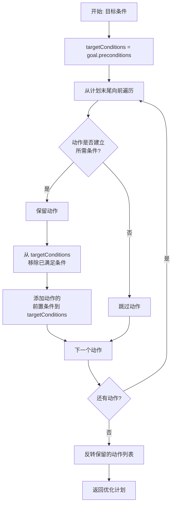

**代码实现**:
```kotlin
private fun backwardPlanningOptimization(
    plan: List<GoapAction>,
    startState: GoapWorldState,
    goal: GoapGoal
): List<GoapAction> {
    if (plan.isEmpty()) return plan
    
    val targetConditions = goal.preconditions.toMutableMap()
    val keptActions = mutableListOf<GoapAction>()
    
    for (action in plan.reversed()) {
        var isNecessary = false
        
        for ((key, value) in action.effects) {
            if (targetConditions[key] == value) {
                isNecessary = true
                targetConditions.remove(key)
                action.preconditions.forEach { (precKey, precValue) ->
                    targetConditions[precKey] = precValue
                }
            }
        }
        
        if (isNecessary) {
            keptActions.add(action)
        }
    }
    
    return keptActions.reversed()
}
```

##### 正向规划优化

**原理**: 模拟计划执行，移除不产生目标进展的动作

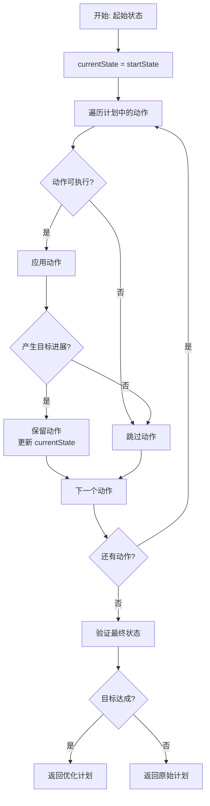

**进展判断条件**:
```kotlin
val progressMade = nextState != currentState &&
    action.effects.any { (key, value) ->
        goal.preconditions.containsKey(key) &&
        currentState.state[key] != goal.preconditions[key] &&
        (value == goal.preconditions[key] || key !in nextState.state)
    }
```

## Sample 示例分析

### WriteAndReviewAgent 工作流程

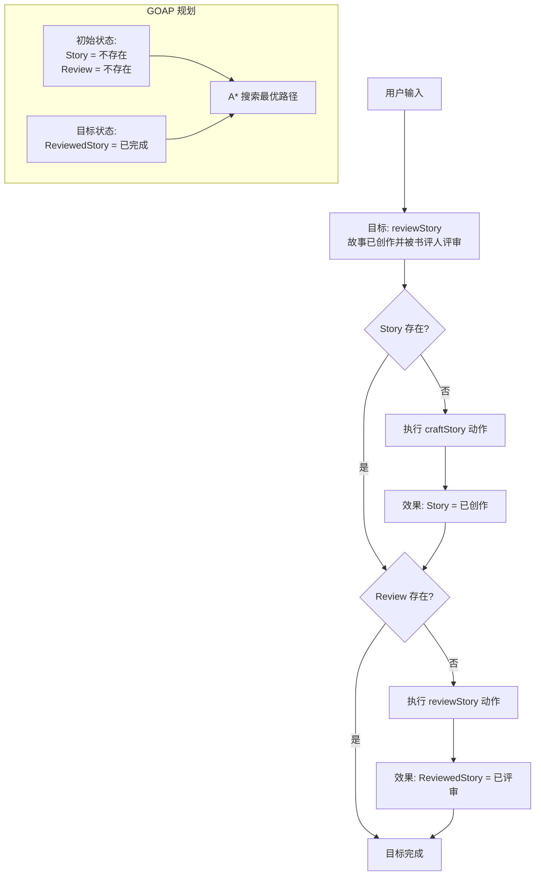

### 状态转换示例

假设用户输入: "Write a story about a brave knight"

#### 初始世界状态
```kotlin
GoapWorldState(
    state = hashMapOf(
        "userInput.exists" to TRUE,
        "story.exists" to FALSE,
        "review.exists" to FALSE
    )
)
```

#### 可用动作

**动作 1: craftStory**
```kotlin
GoapAction(
    name = "craftStory",
    preconditions = mapOf(
        "userInput.exists" to TRUE
    ),
    effects = mapOf(
        "story.exists" to TRUE
    ),
    cost = 1.0
)
```

**动作 2: reviewStory**
```kotlin
GoapAction(
    name = "reviewStory",
    preconditions = mapOf(
        "userInput.exists" to TRUE,
        "story.exists" to TRUE
    ),
    effects = mapOf(
        "review.exists" to TRUE,
        "reviewedStory.complete" to TRUE
    ),
    cost = 1.0
)
```

#### 目标
```kotlin
GoapGoal(
    name = "writeAndReviewStory",
    preconditions = mapOf(
        "reviewedStory.complete" to TRUE
    )
)
```

#### A* 搜索过程

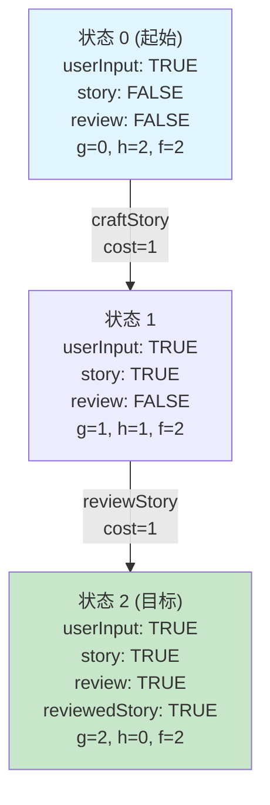

**搜索步骤**:

1. **迭代 1**: 
   - 从 openList 取出状态 0 (f=2)
   - 尝试 craftStory 动作
   - 生成状态 1，加入 openList

2. **迭代 2**:
   - 从 openList 取出状态 1 (f=2)
   - 尝试 reviewStory 动作
   - 生成状态 2（目标状态）
   - 更新 bestGoalNode

3. **路径重建**:
   - 从状态 2 回溯到状态 0
   - 路径: [craftStory, reviewStory]

4. **优化**:
   - 反向优化: 两个动作都对目标有贡献，保留
   - 正向优化: 两个动作都产生进展，保留
   - 最终计划: [craftStory, reviewStory]

### 执行结果

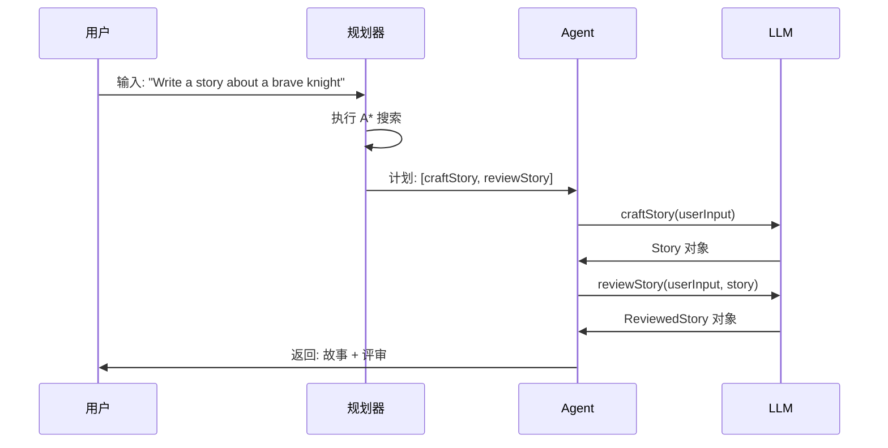

## 算法复杂度分析

### 时间复杂度

- **最坏情况**: O(b^d)
  - b: 分支因子（每个状态的平均可执行动作数）
  - d: 解决方案深度
  
- **实际性能**: 由于启发式函数和剪枝优化，通常远好于最坏情况

### 空间复杂度

- **O(|S|)**: 其中 |S| 是探索的状态数
- 主要存储:
  - openList: O(|S|)
  - gScores: O(|S|)
  - cameFrom: O(|S|)
  - closedSet: O(|S|)

## 关键优化技术总结

1. **早期可达性检查**: 避免对明显不可达目标的搜索
2. **动作排序**: 优先考虑更具体的动作
3. **成本剪枝**: 跳过成本已超过最佳解的路径
4. **状态重新打开**: 允许找到更好路径时重新评估已关闭状态
5. **双重计划优化**: 反向和正向优化相结合
6. **迭代限制**: 防止无限循环

## 算法保证

1. **完备性**: 如果存在解决方案，A* 将找到它
2. **最优性**: 由于使用可采纳启发式函数，A* 保证找到最低成本路径
3. **效率**: 启发式函数引导搜索朝向目标，减少探索的状态数

## 总结

`AStarGoapPlanner.planToGoalFrom` 方法实现了一个高效、优化的 GOAP 规划系统：

- 使用 A* 算法确保找到最优行动序列
- 通过多层优化减少不必要的动作
- 提供早期失败检测避免无效搜索
- 在 Sample 示例中，能够自动规划从用户输入到完成故事评审的完整流程

该实现在理论正确性和实际性能之间取得了良好平衡，适用于复杂的 AI Agent 规划场景。

----

## A* search algorithm

A* (pronounced "A-star") is a graph traversal and pathfinding algorithm that is used in many fields of computer science due to its completeness, optimality, and optimal efficiency. Given a weighted graph, a source node and a goal node, the algorithm finds the shortest path (with respect to the given weights) from source to goal.

One major practical drawback is its ${\displaystyle O(b^{d})}$ space complexity where 
- $d$ is the depth of the shallowest solution (the length of the shortest path from the source node to any given goal node) 
- $b$ is the branching factor (the maximum number of successors for any given state), as it stores all generated nodes in memory. 

Thus, in practical travel-routing systems, it is generally outperformed by algorithms that can pre-process the graph to attain better performance, as well as by memory-bounded approaches; however, A* is still the best solution in many cases.

Peter Hart, Nils Nilsson and Bertram Raphael of Stanford Research Institute (now SRI International) first published the algorithm in 1968. It can be seen as an extension of Dijkstra's algorithm. A* achieves better performance by using heuristics to guide its search.

Compared to Dijkstra's algorithm, the A* algorithm only finds the shortest path from a specified source to a specified goal, and not the shortest-path tree from a specified source to all possible goals. This is a necessary trade-off for using a specific-goal-directed heuristic. For Dijkstra's algorithm, since the entire shortest-path tree is generated, every node is a goal, and there can be no specific-goal-directed heuristic.


A* is an informed search algorithm, or a best-first search, meaning that it is formulated in terms of weighted graphs: starting from a specific starting node of a graph, it aims to find a path to the given goal node having the smallest cost (least distance travelled, shortest time, etc.). It does this by maintaining a tree of paths originating at the start node and extending those paths one edge at a time until the goal node is reached.

At each iteration of its main loop, A* needs to determine which of its paths to extend. It does so based on the cost of the path and an estimate of the cost required to extend the path all the way to the goal. Specifically, A* selects the path that minimizes

$$
{\displaystyle f(n)=g(n)+h(n)}
$$

where 

- $n$ is the next node on the path
- $g(n)$ is the cost of the path from the start node to n
- $h(n)$ is a heuristic function that estimates the cost of the cheapest path from n to the goal. 

The heuristic function is problem-specific. If the heuristic function is admissible – meaning that it never overestimates the actual cost to get to the goal – A* is guaranteed to return a least-cost path from start to goal.


Dijkstra's algorithm 戴克斯特拉算法

https://en.wikipedia.org/wiki/A*_search_algorithm

