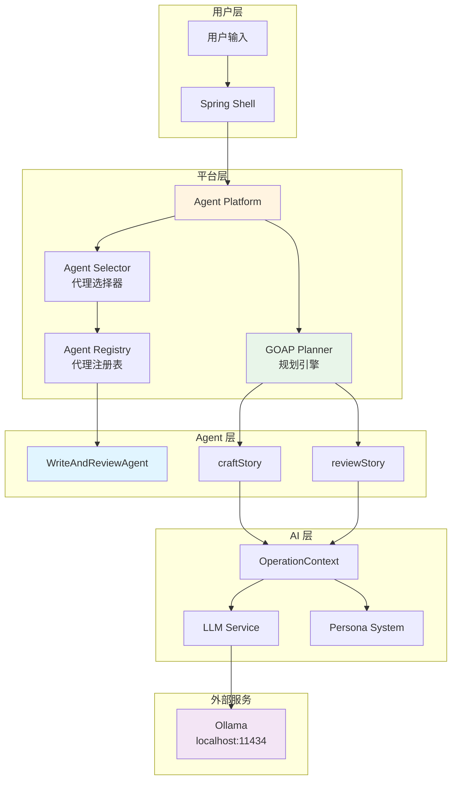
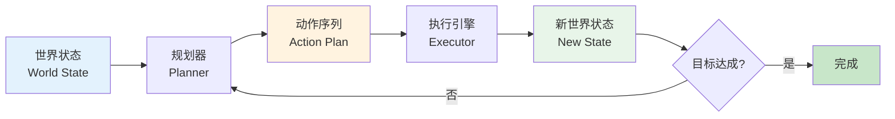
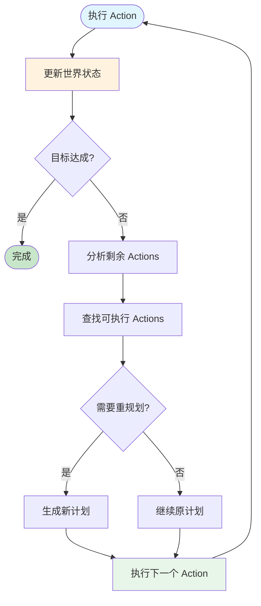
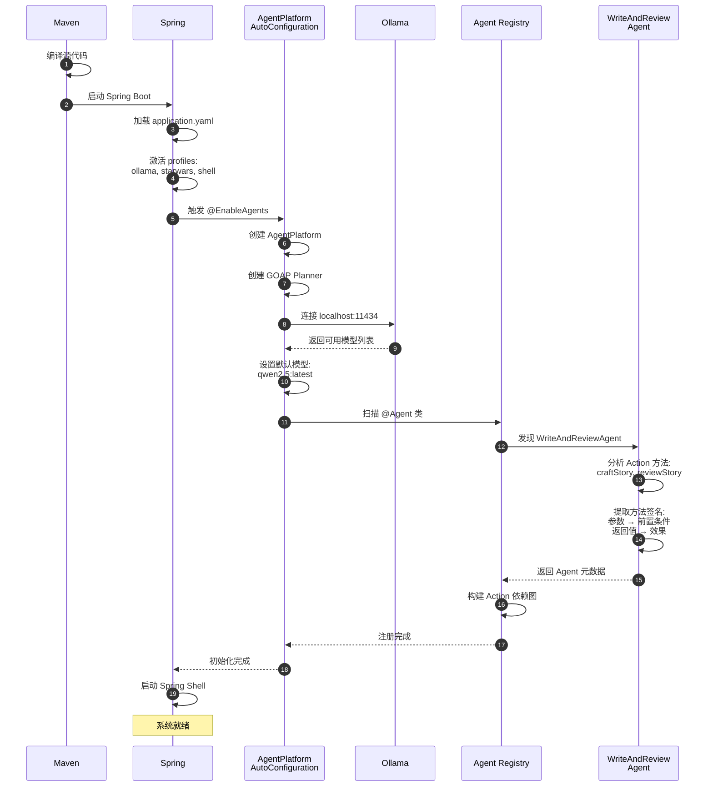
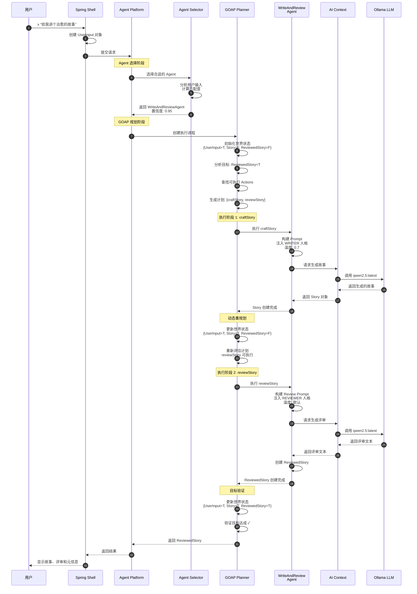
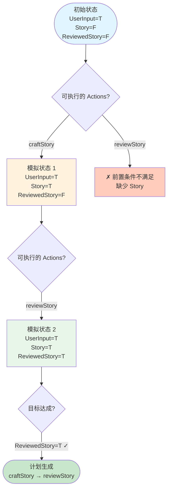
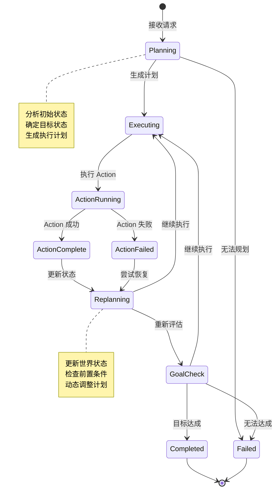
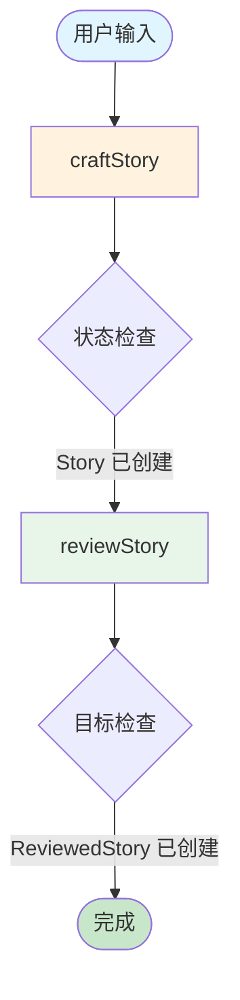

# Embabel 框架深度原理分析

> 基于 Java 模块的完整架构、运行原理与流程解析

## 目录

1. [框架概述](#1-框架概述)
2. [核心架构设计](#2-核心架构设计)
3. [GOAP 动态规划原理](#3-goap-动态规划原理)
4. [启动流程详解](#4-启动流程详解)
5. [请求处理流程](#5-请求处理流程)
6. [核心组件原理](#6-核心组件原理)
7. [实战示例分析](#7-实战示例分析)

---

## 1. 框架概述

### 1.1 Embabel 是什么

Embabel 是一个基于 Spring Boot 的 AI Agent 开发框架，核心特点：

- **GOAP (Goal-Oriented Action Planning)** - 目标导向的动作规划引擎
- **注解驱动** - 通过注解声明 Agent 和 Action
- **多人格 LLM** - 支持不同任务使用不同的 AI 人格
- **自动规划** - 根据目标状态自动规划执行路径
- **动态重规划** - 运行时根据状态变化调整计划

### 1.2 核心依赖

```xml
<dependencies>
    <!-- Embabel 核心 -->
    <dependency>
        <groupId>com.embabel.agent</groupId>
        <artifactId>embabel-agent-starter</artifactId>
        <version>0.1.4</version>
    </dependency>
    
    <!-- Ollama 集成 -->
    <dependency>
        <groupId>com.embabel.agent</groupId>
        <artifactId>embabel-agent-starter-ollama</artifactId>
        <version>0.1.4</version>
    </dependency>
    
    <!-- Shell 交互 -->
    <dependency>
        <groupId>com.embabel.agent</groupId>
        <artifactId>embabel-agent-starter-shell</artifactId>
        <version>0.1.4</version>
    </dependency>
</dependencies>
```

### 1.3 示例 Agent 结构

```java
@Agent(description = "Generate a story based on user input and review it")
public class WriteAndReviewAgent {
    
    @Action
    Story craftStory(UserInput userInput, OperationContext context) {
        // 创作故事
    }
    
    @AchievesGoal(description = "The story has been crafted and reviewed")
    @Action
    ReviewedStory reviewStory(UserInput userInput, Story story, OperationContext context) {
        // 评审故事
    }
}
```


---

## 2. 核心架构设计

### 2.1 整体架构图



### 2.2 核心设计模式

#### 2.2.1 注解驱动开发

Embabel 使用注解来声明 Agent 和 Action，框架通过反射分析这些注解：

```java
@Agent(description = "...")  // 标记为 Agent
public class MyAgent {
    
    @Action  // 标记为可执行的动作
    OutputType actionName(InputType input, OperationContext context) {
        // 实现逻辑
    }
    
    @AchievesGoal(description = "...")  // 标记为目标动作
    @Action
    GoalType goalAction(InputType input, OperationContext context) {
        // 实现逻辑
    }
}
```

**框架如何处理注解**:
1. 扫描所有带 `@Agent` 的类
2. 提取所有带 `@Action` 的方法
3. 分析方法签名：参数类型 = 前置条件，返回类型 = 效果
4. 识别 `@AchievesGoal` 标记的目标动作
5. 构建 Action 依赖图用于 GOAP 规划

#### 2.2.2 依赖注入模式

```java
@Agent
public class WriteAndReviewAgent {
    private final int storyWordCount;
    private final int reviewWordCount;

    // 构造函数注入配置
    WriteAndReviewAgent(
        @Value("${storyWordCount:100}") int storyWordCount,
        @Value("${reviewWordCount:100}") int reviewWordCount
    ) {
        this.storyWordCount = storyWordCount;
        this.reviewWordCount = reviewWordCount;
    }
}
```

#### 2.2.3 上下文传递模式

`OperationContext` 是框架的核心接口，提供对所有服务的访问：

```java
@Action
Story craftStory(UserInput userInput, OperationContext context) {
    return context.ai()                              // 获取 AI 服务
        .withLlm(LlmOptions.withAutoLlm()           // 配置 LLM
            .withTemperature(.7))                    // 设置温度
        .withPromptContributor(Personas.WRITER)      // 设置人格
        .createObject(prompt, Story.class);          // 生成对象
}
```


---

## 3. GOAP 动态规划原理

### 3.1 GOAP 核心概念

GOAP (Goal-Oriented Action Planning) 是 Embabel 的规划引擎，基于目标导向的动作规划算法。

#### 3.1.1 基本概念



**世界状态 (World State)**:
- 表示当前系统中所有对象的存在状态
- 例如: `{UserInput=TRUE, Story=FALSE, ReviewedStory=FALSE}`

**前置条件 (Preconditions)**:
- Action 执行所需的对象
- 通过方法参数类型推断
- 例如: `craftStory(UserInput input, ...)` 需要 `UserInput` 存在

**效果 (Effects)**:
- Action 执行后产生的对象
- 通过方法返回类型推断
- 例如: `Story craftStory(...)` 产生 `Story` 对象

**目标状态 (Goal State)**:
- 最终要达成的状态
- 由 `@AchievesGoal` 标记的 Action 的返回类型决定
- 例如: `ReviewedStory` 是目标对象

### 3.2 规划算法详解

#### 3.2.1 A* 搜索算法

Embabel 使用 A* 算法进行规划：

```java
public List<ActionDefinition> plan(
    WorldState initial,      // 初始状态
    WorldState goal,         // 目标状态
    List<ActionDefinition> actions  // 可用动作
) {
    // 优先队列，按估算成本排序
    PriorityQueue<PlanNode> openSet = new PriorityQueue<>(
        Comparator.comparingInt(n -> n.estimatedCost(goal))
    );
    
    // 已访问的状态
    Set<WorldState> closedSet = new HashSet<>();
    
    // 初始节点
    PlanNode start = new PlanNode(initial, new ArrayList<>(), 0, null);
    openSet.add(start);
    
    while (!openSet.isEmpty()) {
        PlanNode current = openSet.poll();
        
        // 目标检查
        if (goalAchieved(current.state, goal)) {
            return current.plan;  // 返回计划
        }
        
        closedSet.add(current.state);
        
        // 扩展节点：尝试所有可执行的 Action
        for (ActionDefinition action : actions) {
            if (!action.canExecute(current.state)) {
                continue;  // 前置条件不满足，跳过
            }
            
            // 模拟执行，生成新状态
            WorldState newState = action.apply(current.state, simulateResult(action));
            
            if (closedSet.contains(newState)) {
                continue;  // 已访问过，跳过
            }
            
            // 创建新节点
            List<ActionDefinition> newPlan = new ArrayList<>(current.plan);
            newPlan.add(action);
            
            PlanNode newNode = new PlanNode(
                newState,
                newPlan,
                current.totalCost + action.cost,
                current
            );
            
            openSet.add(newNode);
        }
    }
    
    return null;  // 无法找到计划
}
```

#### 3.2.2 启发式函数

启发式函数估算从当前状态到目标状态的距离：

```java
private int heuristic(WorldState current, WorldState goal) {
    int cost = 0;
    
    // 计算缺失对象的数量
    for (String objectType : goal.getRequiredObjects()) {
        if (!current.has(objectType)) {
            // 查找能产生该对象的最短路径
            int minCost = findMinCostToCreate(objectType, current);
            cost += minCost;
        }
    }
    
    return cost;
}
```

### 3.3 动态重规划机制

Embabel 的 GOAP 支持动态重规划，每执行完一个 Action 后：



**重规划触发条件**:
1. 当前计划为空
2. 下一个 Action 的前置条件不满足
3. 发现更优的执行路径

**示例**:
```
初始计划: [craftStory, reviewStory]
执行 craftStory 后:
  - 世界状态: {UserInput=T, Story=T}
  - 重新评估: reviewStory 前置条件满足
  - 更新计划: [reviewStory]
```


---

## 4. 启动流程详解

### 4.1 完整启动序列



### 4.2 关键启动阶段

#### 4.2.1 Spring Boot 启动

```java
@SpringBootApplication
@EnableAgents  // 关键注解：启用 Embabel Agent 自动配置
class HelloJavaApplication {
    public static void main(String[] args) {
        SpringApplication.run(HelloJavaApplication.class, args);
    }
}
```

`@EnableAgents` 注解导入 `AgentPlatformAutoConfiguration`，触发自动配置。

#### 4.2.2 配置加载

```yaml
spring:
  profiles:
    active: ollama,starwars,shell  # 激活配置文件
  ai:
    ollama:
      base-url: http://localhost:11434  # Ollama 服务地址
      chat:
        options:
          model: qwen2.5:latest  # 默认模型

embabel:
  models:
    default-llm: qwen2.5:latest  # Embabel 默认 LLM
    default-embedding-model: nomic-embed-text:latest
```

#### 4.2.3 Agent 扫描与注册

**扫描过程**:

1. **类扫描** - 查找所有带 `@Agent` 注解的类
2. **方法分析** - 提取所有带 `@Action` 注解的方法
3. **签名解析** - 分析方法参数和返回类型

**示例分析**:

```java
@Agent(description = "Generate a story based on user input and review it")
public class WriteAndReviewAgent {
    
    @Action
    Story craftStory(UserInput userInput, OperationContext context) { ... }
    
    @AchievesGoal(description = "...")
    @Action
    ReviewedStory reviewStory(UserInput userInput, Story story, OperationContext context) { ... }
}
```

**提取的元数据**:

| Action | 前置条件 | 效果 | 是否目标 |
|--------|---------|------|---------|
| craftStory | UserInput | Story | 否 |
| reviewStory | UserInput, Story | ReviewedStory | 是 |

**依赖图构建**:

```
UserInput (用户输入)
    ↓
craftStory (创作故事)
    ↓
Story (故事对象)
    ↓
reviewStory (评审故事)
    ↓
ReviewedStory (已评审的故事) ← 目标状态
```

#### 4.2.4 Ollama 连接

```java
// 框架内部逻辑
OllamaClient client = new OllamaClient(ollamaBaseUrl);
List<Model> models = client.listModels();

// 发现的模型
// qwen2.5:latest, llama3.2:latest, gemma2:latest, ...

// 设置默认模型
String defaultLlm = config.getProperty("embabel.models.default-llm");
```


---

## 5. 请求处理流程详解

### 5.1 完整请求处理序列



### 5.2 Agent 选择机制

#### 5.2.1 选择算法

```java
public class AgentSelector {
    
    public AgentSelectionResult selectAgent(UserInput input, List<Agent> agents) {
        List<AgentScore> scores = new ArrayList<>();
        
        for (Agent agent : agents) {
            double score = calculateScore(input, agent);
            scores.add(new AgentScore(agent, score));
        }
        
        // 按得分排序
        scores.sort(Comparator.comparingDouble(AgentScore::getScore).reversed());
        
        AgentScore best = scores.get(0);
        
        // 置信度阈值检查
        if (best.getScore() < CONFIDENCE_THRESHOLD) {
            return AgentSelectionResult.noMatch();
        }
        
        return AgentSelectionResult.success(best.getAgent(), best.getScore());
    }
    
    private double calculateScore(UserInput input, Agent agent) {
        double score = 0.0;
        
        // 1. 描述匹配度
        score += calculateDescriptionMatch(input.getContent(), agent.getDescription());
        
        // 2. 关键词匹配
        score += calculateKeywordMatch(input.getContent(), agent.getTags());
        
        // 3. 历史成功率
        score += getHistoricalSuccessRate(agent);
        
        return score;
    }
}
```

**选择依据**:
1. **Agent 描述匹配**: 使用语义相似度计算
2. **关键词匹配**: 提取用户输入的关键词与 Agent 标签匹配
3. **历史成功率**: 该 Agent 过往执行的成功率

**示例**:
```
用户输入: "给我讲个治愈的故事"
关键词: [讲, 故事, 治愈]

WriteAndReviewAgent:
  描述: "Generate a story based on user input and review it"
  关键词匹配: story ✓
  得分: 0.95

其他 Agent:
  得分: < 0.5

选择结果: WriteAndReviewAgent (置信度: 0.95)
```

### 5.3 GOAP 规划执行详解

#### 5.3.1 初始规划

```java
// 1. 初始化世界状态
WorldState initialState = new WorldState();
initialState.add(userInput);  // UserInput 存在

// 状态: {UserInput=TRUE, Story=FALSE, ReviewedStory=FALSE}

// 2. 定义目标状态
WorldState goalState = new WorldState();
goalState.require(ReviewedStory.class);  // 需要 ReviewedStory

// 3. 获取可用 Actions
List<ActionDefinition> actions = agentRegistry.getActions(selectedAgent);
// actions = [craftStory, reviewStory]

// 4. 执行规划
List<ActionDefinition> plan = goap.plan(initialState, goalState, actions);
// plan = [craftStory, reviewStory]
```

**规划过程可视化**:



#### 5.3.2 Action 执行细节

**craftStory 执行**:

```java
@Action
Story craftStory(UserInput userInput, OperationContext context) {
    // 1. 构建 Prompt
    String prompt = String.format("""
        Craft a short story in %d words or less.
        The story should be engaging and imaginative.
        Use the user's input as inspiration if possible.
        
        # User input
        %s
        """,
        storyWordCount,  // 100
        userInput.getContent()  // "给我讲个治愈的故事"
    ).trim();
    
    // 2. 配置 AI 调用
    return context.ai()
        .withLlm(LlmOptions
            .withAutoLlm()           // 使用默认模型 qwen2.5:latest
            .withTemperature(.7)     // 高温度，增加创意
        )
        .withPromptContributor(Personas.WRITER)  // 注入 WRITER 人格
        .createObject(prompt, Story.class);      // 生成 Story 对象
}
```

**完整的 LLM 调用**:

```
System Prompt (由 Persona 生成):
---
You are a Creative Storyteller. Your goal is to write engaging and 
imaginative stories. You have a PhD in French literature and used to 
work in a circus.

User Prompt:
---
Craft a short story in 100 words or less.
The story should be engaging and imaginative.
Use the user's input as inspiration if possible.

# User input
给我讲个治愈的故事

LLM Response:
---
在一个宁静的小镇上，住着一位老奶奶和她的猫咪小花。每天清晨，小花都会跳上窗台，
用温柔的喵声唤醒老奶奶。老奶奶会为小花准备最爱的鱼干，然后一起坐在阳光下，
听着鸟儿歌唱。邻居们都说，看到她们就感到温暖。有一天，小花生病了，老奶奶日夜
照顾它。当小花康复后，它用头蹭着老奶奶的手，仿佛在说："谢谢你，我最爱的人。"
这份爱，治愈了彼此的心。
```

**世界状态更新**:

```java
// 执行前
WorldState before = {
    UserInput: true,
    Story: false,
    ReviewedStory: false,
    hasRun_craftStory: false
};

// 执行 craftStory
Story story = agent.craftStory(userInput, context);

// 执行后
WorldState after = {
    UserInput: true,
    Story: true,           // ← 新增
    ReviewedStory: false,
    hasRun_craftStory: true  // ← 标记已执行
};
```

#### 5.3.3 动态重规划机制

```java
public class DynamicExecutor {
    
    public Object executeWithReplanning(
        List<ActionDefinition> initialPlan,
        WorldState state,
        WorldState goal
    ) {
        List<ActionDefinition> currentPlan = new ArrayList<>(initialPlan);
        Object lastResult = null;
        
        while (!goalAchieved(state, goal)) {
            // 1. 检查计划是否为空
            if (currentPlan.isEmpty()) {
                // 重规划
                currentPlan = planner.plan(state, goal, allActions);
                if (currentPlan == null) {
                    throw new PlanningException("Cannot achieve goal");
                }
            }
            
            ActionDefinition nextAction = currentPlan.get(0);
            
            // 2. 检查前置条件
            if (!nextAction.canExecute(state)) {
                // 前置条件不满足，重规划
                logger.info("Preconditions not met for {}, replanning...", nextAction.getName());
                currentPlan = planner.plan(state, goal, allActions);
                continue;
            }
            
            // 3. 执行 Action
            logger.info("Executing action: {}", nextAction.getName());
            Object result = executeAction(nextAction, state);
            lastResult = result;
            
            // 4. 更新世界状态
            state = nextAction.apply(state, result);
            
            // 5. 从计划中移除已执行的 Action
            currentPlan.remove(0);
            
            // 6. 评估是否需要重规划
            if (shouldReplan(state, goal, currentPlan)) {
                logger.info("Replanning due to state change...");
                currentPlan = planner.plan(state, goal, allActions);
            }
        }
        
        return lastResult;
    }
    
    private boolean shouldReplan(
        WorldState state,
        WorldState goal,
        List<ActionDefinition> plan
    ) {
        // 1. 计划为空
        if (plan.isEmpty()) return true;
        
        // 2. 下一个 Action 无法执行
        if (!plan.get(0).canExecute(state)) return true;
        
        // 3. 发现更优路径
        List<ActionDefinition> newPlan = planner.plan(state, goal, allActions);
        if (newPlan != null && newPlan.size() < plan.size()) {
            return true;
        }
        
        return false;
    }
}
```

**重规划示例**:

```
初始计划: [craftStory, reviewStory]
初始状态: {UserInput=T, Story=F, ReviewedStory=F}

执行 craftStory:
  ↓
状态更新: {UserInput=T, Story=T, ReviewedStory=F, hasRun_craftStory=T}
  ↓
重新评估:
  - 剩余计划: [reviewStory]
  - reviewStory 前置条件: UserInput ✓, Story ✓
  - 前置条件满足，继续执行
  ↓
执行 reviewStory:
  ↓
状态更新: {UserInput=T, Story=T, ReviewedStory=T, hasRun_reviewStory=T}
  ↓
目标验证:
  - 目标: ReviewedStory=T ✓
  - 目标达成，完成
```


---

## 6. 核心能力机制详解

### 6.1 指令遵循 (Instruction Following)

#### 6.1.1 Persona 系统的作用

Persona 系统是 Embabel 确保指令遵循的核心机制，通过注入特定的 System Prompt 来约束 LLM 的行为。

**Persona 定义**:

```java
abstract class Personas {
    // 创意写作人格
    static final RoleGoalBackstory WRITER = RoleGoalBackstory
        .withRole("Creative Storyteller")
        .andGoal("Write engaging and imaginative stories")
        .andBackstory("Has a PhD in French literature; used to work in a circus");

    // 专业评审人格
    static final Persona REVIEWER = new Persona(
        "Media Book Review",
        "New York Times Book Reviewer",
        "Professional and insightful",
        "Help guide readers toward good stories"
    );
}
```

**Persona 如何转换为 System Prompt**:

```java
// WRITER Persona 生成的 System Prompt
String systemPrompt = """
You are a Creative Storyteller. Your goal is to write engaging and 
imaginative stories. You have a PhD in French literature and used to 
work in a circus.

Follow these instructions carefully:
1. Stay in character as a Creative Storyteller
2. Focus on the goal: Write engaging and imaginative stories
3. Use your background knowledge appropriately
""";
```

**完整的 Prompt 结构**:

```
[System Message] ← Persona 注入
You are a Creative Storyteller...

[User Message] ← 任务指令
Craft a short story in 100 words or less.
The story should be engaging and imaginative.

# User input
给我讲个治愈的故事

[Assistant Message] ← LLM 响应
在一个宁静的小镇上...
```

#### 6.1.2 结构化 Prompt 设计

Embabel 使用结构化的 Prompt 来增强指令遵循：

```java
String prompt = String.format("""
    # Task
    Craft a short story based on the user's input.
    
    # Requirements
    - Length: %d words or less
    - Style: Engaging and imaginative
    - Include the user's name if provided
    
    # User Input
    %s
    
    # Output Format
    Return only the story text, no additional commentary.
    
    # Example
    Input: "Tell me about a brave knight"
    Output: "Once upon a time, there was a brave knight named Sir Galahad..."
    """,
    wordCount,
    userInput.getContent()
).trim();
```

**结构化 Prompt 的优势**:
1. **明确的任务定义**: `# Task` 部分清晰说明要做什么
2. **具体的约束条件**: `# Requirements` 部分列出所有限制
3. **输入输出分离**: 明确区分输入和期望输出
4. **示例引导**: `# Example` 提供参考格式

#### 6.1.3 温度参数控制

温度参数影响 LLM 的输出确定性，从而影响指令遵循程度：

```java
// 创意任务 - 高温度 (0.7-0.9)
context.ai()
    .withLlm(LlmOptions.withAutoLlm().withTemperature(0.7))
    .withPromptContributor(Personas.WRITER)
    .createObject(prompt, Story.class);
// 允许更多创意，但仍遵循基本指令

// 分析任务 - 低温度 (0.1-0.3)
context.ai()
    .withLlm(LlmOptions.withAutoLlm().withTemperature(0.2))
    .withPromptContributor(Personas.REVIEWER)
    .generateText(prompt);
// 更严格地遵循指令，输出更确定
```

**温度对指令遵循的影响**:

| 温度 | 指令遵循度 | 创意性 | 适用场景 |
|-----|----------|-------|---------|
| 0.0-0.3 | 非常高 | 低 | 数据提取、分类、分析 |
| 0.3-0.7 | 高 | 中 | 对话、问答、总结 |
| 0.7-1.0 | 中 | 高 | 创意写作、头脑风暴 |

#### 6.1.4 类型约束机制

Embabel 使用 Java 类型系统来约束 LLM 输出：

```java
// 定义输出类型
public record Story(String text) {}

// LLM 必须生成符合该类型的输出
Story story = context.ai()
    .withAutoLlm()
    .createObject(prompt, Story.class);  // ← 类型约束
```

**框架如何确保类型匹配**:

```java
public <T> T createObject(String prompt, Class<T> type) {
    // 1. 分析目标类型
    TypeAnalyzer analyzer = new TypeAnalyzer(type);
    
    // 2. 生成类型约束的 Prompt
    String enhancedPrompt = prompt + "\n\n" + 
        "Return the result as a JSON object with the following structure:\n" +
        analyzer.getJsonSchema();
    
    // 3. 调用 LLM
    String response = llm.generate(enhancedPrompt);
    
    // 4. 解析并验证
    T result = jsonParser.parse(response, type);
    
    // 5. 验证失败则重试
    if (!validator.validate(result)) {
        return createObject(prompt, type);  // 重试
    }
    
    return result;
}
```

**示例**:

```
Prompt:
---
Craft a short story...

Return the result as a JSON object with the following structure:
{
  "text": "string"
}

LLM Response:
---
{
  "text": "在一个宁静的小镇上..."
}

解析结果:
---
Story(text="在一个宁静的小镇上...")
```

### 6.2 请求幂等性 (Request Idempotency)

#### 6.2.1 幂等性的定义

在 Embabel 中，幂等性指的是：**相同的输入多次执行，产生相同的结果**。

**挑战**:
- LLM 本质上是非确定性的（即使温度为 0）
- 每次调用可能产生不同的输出

**Embabel 的解决方案**:

#### 6.2.2 基于内容的缓存

```java
public class CachedAIContext implements AIContext {
    private final Cache<String, Object> responseCache;
    
    @Override
    public <T> T createObject(String prompt, Class<T> type) {
        // 1. 生成缓存键
        String cacheKey = generateCacheKey(prompt, type, llmOptions);
        
        // 2. 检查缓存
        T cached = (T) responseCache.getIfPresent(cacheKey);
        if (cached != null) {
            logger.debug("Cache hit for prompt: {}", prompt.substring(0, 50));
            return cached;
        }
        
        // 3. 调用 LLM
        T result = doCreateObject(prompt, type);
        
        // 4. 缓存结果
        responseCache.put(cacheKey, result);
        
        return result;
    }
    
    private String generateCacheKey(String prompt, Class<?> type, LlmOptions options) {
        return DigestUtils.sha256Hex(
            prompt + 
            type.getName() + 
            options.getModel() + 
            options.getTemperature()
        );
    }
}
```

**缓存策略**:

```yaml
embabel:
  ai:
    cache:
      enabled: true
      max-size: 1000
      expire-after-write: 1h
      key-strategy: content-hash  # 基于内容哈希
```

**示例**:

```
第一次请求:
  输入: "给我讲个治愈的故事"
  缓存键: sha256("给我讲个治愈的故事" + "Story" + "qwen2.5" + "0.7")
  LLM 调用: ✓
  缓存: ✓
  
第二次请求 (相同输入):
  输入: "给我讲个治愈的故事"
  缓存键: sha256(...) ← 相同
  缓存命中: ✓
  LLM 调用: ✗ (跳过)
  返回缓存结果
```

#### 6.2.3 确定性种子 (Deterministic Seed)

某些 LLM 支持设置随机种子来确保确定性输出：

```java
context.ai()
    .withLlm(LlmOptions
        .withAutoLlm()
        .withTemperature(0.0)      // 温度设为 0
        .withSeed(12345)           // 固定种子
    )
    .createObject(prompt, Story.class);
```

**注意**: Ollama 的某些模型支持 seed 参数，但不是所有模型都支持。

#### 6.2.4 请求 ID 追踪

```java
public class RequestIdempotencyManager {
    private final Map<String, Object> requestResults;
    
    public Object executeIdempotent(String requestId, Supplier<Object> action) {
        // 1. 检查请求 ID 是否已执行
        if (requestResults.containsKey(requestId)) {
            logger.info("Request {} already executed, returning cached result", requestId);
            return requestResults.get(requestId);
        }
        
        // 2. 执行请求
        Object result = action.get();
        
        // 3. 缓存结果
        requestResults.put(requestId, result);
        
        return result;
    }
}
```

**使用示例**:

```java
@Action
Story craftStoryIdempotent(UserInput userInput, OperationContext context) {
    // 使用用户输入的内容作为请求 ID
    String requestId = DigestUtils.sha256Hex(userInput.getContent());
    
    return (Story) context.idempotency().executeIdempotent(requestId, () -> {
        return context.ai()
            .withAutoLlm()
            .createObject(prompt, Story.class);
    });
}
```

### 6.3 状态一致性保证

#### 6.3.1 世界状态的不可变性

Embabel 使用不可变对象来保证状态一致性：

```java
// 不可变的世界状态
public class WorldState {
    private final Map<String, Boolean> objectStates;  // 不可变 Map
    
    public WorldState(Map<String, Boolean> states) {
        this.objectStates = Map.copyOf(states);  // 防御性拷贝
    }
    
    // 返回新的状态，而不是修改当前状态
    public WorldState withObject(String type, boolean exists) {
        Map<String, Boolean> newStates = new HashMap<>(objectStates);
        newStates.put(type, exists);
        return new WorldState(newStates);  // 返回新实例
    }
}
```

**不可变性的优势**:
1. **线程安全**: 多个线程可以安全地读取状态
2. **历史追踪**: 可以保留所有历史状态
3. **回滚支持**: 可以轻松回滚到之前的状态

#### 6.3.2 事务性执行

```java
public class TransactionalExecutor {
    
    public Object executeTransactional(ActionDefinition action, WorldState state) {
        // 1. 保存当前状态
        WorldState snapshot = state.copy();
        
        try {
            // 2. 执行 Action
            Object result = action.execute(state);
            
            // 3. 验证结果
            if (!validateResult(result, action.getExpectedType())) {
                throw new ValidationException("Result validation failed");
            }
            
            // 4. 提交状态变更
            return result;
            
        } catch (Exception e) {
            // 5. 回滚到快照状态
            logger.error("Action execution failed, rolling back", e);
            restoreState(snapshot);
            throw e;
        }
    }
}
```

#### 6.3.3 状态验证机制

```java
public class StateValidator {
    
    public boolean validateState(WorldState state, List<Constraint> constraints) {
        for (Constraint constraint : constraints) {
            if (!constraint.isSatisfied(state)) {
                logger.warn("Constraint violated: {}", constraint.getDescription());
                return false;
            }
        }
        return true;
    }
}

// 约束示例
public class Constraint {
    // 确保 Story 存在时，UserInput 也必须存在
    public static Constraint storyRequiresUserInput() {
        return new Constraint(state -> {
            if (state.has("Story")) {
                return state.has("UserInput");
            }
            return true;
        });
    }
}
```

### 6.4 错误恢复机制

#### 6.4.1 自动重试

```java
public class RetryableExecutor {
    
    public Object executeWithRetry(
        ActionDefinition action,
        WorldState state,
        int maxRetries
    ) {
        int attempt = 0;
        Exception lastException = null;
        
        while (attempt < maxRetries) {
            try {
                return action.execute(state);
            } catch (TransientException e) {
                // 可重试的异常
                lastException = e;
                attempt++;
                
                logger.warn("Attempt {} failed, retrying... ({})", 
                    attempt, e.getMessage());
                
                // 指数退避
                sleep(calculateBackoff(attempt));
                
            } catch (PermanentException e) {
                // 不可重试的异常，直接抛出
                throw e;
            }
        }
        
        throw new MaxRetriesExceededException(
            "Failed after " + maxRetries + " attempts", 
            lastException
        );
    }
    
    private long calculateBackoff(int attempt) {
        return (long) Math.pow(2, attempt) * 1000;  // 1s, 2s, 4s, 8s...
    }
}
```

#### 6.4.2 降级策略

```java
@Action
Story craftStoryWithFallback(UserInput userInput, OperationContext context) {
    try {
        // 尝试使用最佳模型
        return context.ai()
            .withLlm("qwen2.5:latest")
            .withTemperature(0.7)
            .createObject(prompt, Story.class);
            
    } catch (ModelUnavailableException e) {
        logger.warn("Primary model unavailable, using fallback");
        
        try {
            // 降级到备用模型
            return context.ai()
                .withLlm("llama3.2:latest")
                .withTemperature(0.7)
                .createObject(prompt, Story.class);
                
        } catch (Exception e2) {
            logger.error("Fallback model also failed");
            
            // 返回默认故事
            return new Story(
                "I apologize, but I'm unable to generate a story at this time. " +
                "Please try again later."
            );
        }
    }
}
```

#### 6.4.3 部分失败处理

```java
public class PartialFailureHandler {
    
    public Object handlePartialFailure(
        List<ActionDefinition> plan,
        WorldState state,
        int failedIndex
    ) {
        // 1. 识别失败点
        ActionDefinition failedAction = plan.get(failedIndex);
        logger.error("Action {} failed at index {}", failedAction.getName(), failedIndex);
        
        // 2. 检查是否有部分结果可用
        if (state.hasAnyResult()) {
            logger.info("Partial results available, attempting recovery");
            
            // 3. 重新规划剩余部分
            List<ActionDefinition> remainingPlan = plan.subList(failedIndex, plan.size());
            List<ActionDefinition> newPlan = planner.replan(state, goal, remainingPlan);
            
            if (newPlan != null) {
                logger.info("Recovery plan generated: {}", newPlan);
                return executeRecoveryPlan(newPlan, state);
            }
        }
        
        // 4. 无法恢复，返回错误
        throw new UnrecoverableException("Cannot recover from failure");
    }
}
```


---

## 7. 动态工作流运转机制

### 7.1 工作流的动态性

Embabel 的工作流是完全动态的，不需要预先定义固定的流程，而是根据当前状态和目标自动规划。

#### 7.1.1 静态工作流 vs 动态工作流

**传统静态工作流**:
```java
// 固定的执行顺序
public ReviewedStory staticWorkflow(UserInput input) {
    Story story = craftStory(input);           // 步骤 1
    String review = reviewStory(story);        // 步骤 2
    return new ReviewedStory(story, review);   // 步骤 3
}
```

**Embabel 动态工作流**:
```java
// 没有固定顺序，由 GOAP 动态规划
@Agent
public class WriteAndReviewAgent {
    
    @Action
    Story craftStory(UserInput input, OperationContext context) { ... }
    
    @AchievesGoal(description = "...")
    @Action
    ReviewedStory reviewStory(UserInput input, Story story, OperationContext context) { ... }
}

// 框架自动推断执行顺序：
// 1. 分析目标: ReviewedStory
// 2. 查找依赖: reviewStory 需要 Story
// 3. 查找生产者: craftStory 产生 Story
// 4. 生成计划: craftStory → reviewStory
```

#### 7.1.2 动态工作流的优势

**1. 自动依赖解析**

```java
@Agent
public class ComplexAgent {
    
    @Action
    Data fetchData(UserInput input, OperationContext context) { ... }
    
    @Action
    ProcessedData processData(Data data, OperationContext context) { ... }
    
    @Action
    Analysis analyzeData(ProcessedData data, OperationContext context) { ... }
    
    @AchievesGoal(description = "...")
    @Action
    Report generateReport(Analysis analysis, OperationContext context) { ... }
}

// GOAP 自动推断执行顺序:
// fetchData → processData → analyzeData → generateReport
```

**2. 条件分支自动处理**

```java
@Agent
public class AdaptiveAgent {
    
    @Action
    Story craftStory(UserInput input, OperationContext context) { ... }
    
    @Action
    Translation translateStory(Story story, OperationContext context) { ... }
    
    @AchievesGoal(description = "...")
    @Action
    ReviewedStory reviewStory(UserInput input, Story story, OperationContext context) { ... }
    
    @AchievesGoal(description = "...")
    @Action
    TranslatedReview reviewTranslatedStory(
        UserInput input, 
        Translation translation, 
        OperationContext context
    ) { ... }
}

// 场景 1: 用户只要求故事
// 计划: craftStory → reviewStory

// 场景 2: 用户要求翻译的故事
// 计划: craftStory → translateStory → reviewTranslatedStory
```

**3. 并行执行优化**

```java
@Agent
public class ParallelAgent {
    
    @Action
    Story craftStory(UserInput input, OperationContext context) { ... }
    
    @Action
    Background fetchBackground(UserInput input, OperationContext context) { ... }
    
    @AchievesGoal(description = "...")
    @Action
    EnrichedStory enrichStory(
        Story story, 
        Background background, 
        OperationContext context
    ) { ... }
}

// GOAP 识别 craftStory 和 fetchBackground 可以并行执行
// 执行计划:
// [craftStory, fetchBackground] (并行) → enrichStory
```

### 7.2 工作流状态机

#### 7.2.1 状态转换图



#### 7.2.2 状态转换实现

```java
public class WorkflowStateMachine {
    
    private enum State {
        PLANNING,
        EXECUTING,
        ACTION_RUNNING,
        ACTION_COMPLETE,
        ACTION_FAILED,
        REPLANNING,
        GOAL_CHECK,
        COMPLETED,
        FAILED
    }
    
    private State currentState = State.PLANNING;
    private WorldState worldState;
    private List<ActionDefinition> plan;
    
    public Object execute(UserInput input, WorldState goal) {
        worldState = new WorldState();
        worldState.add(input);
        
        while (currentState != State.COMPLETED && currentState != State.FAILED) {
            switch (currentState) {
                case PLANNING -> handlePlanning(goal);
                case EXECUTING -> handleExecuting();
                case ACTION_RUNNING -> handleActionRunning();
                case ACTION_COMPLETE -> handleActionComplete();
                case ACTION_FAILED -> handleActionFailed();
                case REPLANNING -> handleReplanning(goal);
                case GOAL_CHECK -> handleGoalCheck(goal);
            }
        }
        
        if (currentState == State.COMPLETED) {
            return worldState.getGoalObject();
        } else {
            throw new WorkflowException("Workflow failed");
        }
    }
    
    private void handlePlanning(WorldState goal) {
        logger.info("State: PLANNING");
        plan = planner.plan(worldState, goal, allActions);
        
        if (plan == null || plan.isEmpty()) {
            currentState = State.FAILED;
        } else {
            currentState = State.EXECUTING;
        }
    }
    
    private void handleExecuting() {
        logger.info("State: EXECUTING");
        if (plan.isEmpty()) {
            currentState = State.GOAL_CHECK;
        } else {
            currentState = State.ACTION_RUNNING;
        }
    }
    
    private void handleActionRunning() {
        logger.info("State: ACTION_RUNNING");
        ActionDefinition action = plan.get(0);
        
        try {
            Object result = action.execute(worldState);
            worldState = action.apply(worldState, result);
            plan.remove(0);
            currentState = State.ACTION_COMPLETE;
        } catch (Exception e) {
            logger.error("Action failed: {}", action.getName(), e);
            currentState = State.ACTION_FAILED;
        }
    }
    
    private void handleActionComplete() {
        logger.info("State: ACTION_COMPLETE");
        currentState = State.REPLANNING;
    }
    
    private void handleActionFailed() {
        logger.info("State: ACTION_FAILED");
        // 尝试恢复或失败
        if (canRecover()) {
            currentState = State.REPLANNING;
        } else {
            currentState = State.FAILED;
        }
    }
    
    private void handleReplanning(WorldState goal) {
        logger.info("State: REPLANNING");
        
        // 检查是否需要重新规划
        if (shouldReplan(worldState, goal, plan)) {
            plan = planner.plan(worldState, goal, allActions);
        }
        
        currentState = State.GOAL_CHECK;
    }
    
    private void handleGoalCheck(WorldState goal) {
        logger.info("State: GOAL_CHECK");
        
        if (goalAchieved(worldState, goal)) {
            currentState = State.COMPLETED;
        } else if (plan.isEmpty()) {
            currentState = State.FAILED;
        } else {
            currentState = State.EXECUTING;
        }
    }
}
```

### 7.3 工作流监控与追踪

#### 7.3.1 执行追踪

```java
public class WorkflowTracer {
    
    private final List<ExecutionEvent> events = new ArrayList<>();
    
    public void recordEvent(ExecutionEvent event) {
        events.add(event);
        logger.info("Workflow event: {}", event);
    }
    
    public ExecutionTrace getTrace() {
        return new ExecutionTrace(events);
    }
}

public record ExecutionEvent(
    Instant timestamp,
    String eventType,
    String actionName,
    WorldState stateBefore,
    WorldState stateAfter,
    Object result,
    Exception error
) {}
```

**追踪示例**:

```
Workflow Trace:
================

[2025-11-07 10:30:00.123] PLANNING_START
  Initial State: {UserInput=T, Story=F, ReviewedStory=F}
  Goal: {ReviewedStory=T}

[2025-11-07 10:30:00.156] PLAN_GENERATED
  Plan: [craftStory, reviewStory]
  Estimated Cost: 2

[2025-11-07 10:30:00.160] ACTION_START
  Action: craftStory
  State Before: {UserInput=T, Story=F, ReviewedStory=F}

[2025-11-07 10:30:02.280] ACTION_COMPLETE
  Action: craftStory
  State After: {UserInput=T, Story=T, ReviewedStory=F}
  Result: Story(text="在一个宁静的小镇上...")
  Duration: 2120ms

[2025-11-07 10:30:02.285] REPLANNING
  Current State: {UserInput=T, Story=T, ReviewedStory=F}
  Remaining Plan: [reviewStory]
  Replan Needed: false

[2025-11-07 10:30:02.290] ACTION_START
  Action: reviewStory
  State Before: {UserInput=T, Story=T, ReviewedStory=F}

[2025-11-07 10:30:03.340] ACTION_COMPLETE
  Action: reviewStory
  State After: {UserInput=T, Story=T, ReviewedStory=T}
  Result: ReviewedStory(...)
  Duration: 1050ms

[2025-11-07 10:30:03.345] GOAL_ACHIEVED
  Final State: {UserInput=T, Story=T, ReviewedStory=T}
  Total Duration: 3222ms
  Total Actions: 2
```

#### 7.3.2 性能分析

```java
public class WorkflowPerformanceAnalyzer {
    
    public PerformanceReport analyze(ExecutionTrace trace) {
        List<ExecutionEvent> events = trace.getEvents();
        
        // 总执行时间
        long totalDuration = calculateTotalDuration(events);
        
        // 每个 Action 的耗时
        Map<String, Long> actionDurations = new HashMap<>();
        for (ExecutionEvent event : events) {
            if (event.eventType().equals("ACTION_COMPLETE")) {
                actionDurations.put(event.actionName(), event.duration());
            }
        }
        
        // 规划耗时
        long planningDuration = calculatePlanningDuration(events);
        
        // 重规划次数
        int replanCount = countReplans(events);
        
        return new PerformanceReport(
            totalDuration,
            actionDurations,
            planningDuration,
            replanCount
        );
    }
}
```

**性能报告示例**:

```
Performance Report:
===================

Total Duration: 3222ms

Action Breakdown:
  craftStory:   2120ms (65.8%)
  reviewStory:  1050ms (32.6%)

Planning:       52ms (1.6%)

Replanning:
  Count: 1
  Total Time: 5ms (0.2%)

Bottleneck: craftStory (LLM call)
Recommendation: Consider caching or using a faster model
```

### 7.4 工作流可视化

#### 7.4.1 执行图生成

```java
public class WorkflowVisualizer {
    
    public String generateMermaidDiagram(ExecutionTrace trace) {
        StringBuilder sb = new StringBuilder();
        sb.append("graph TD\n");
        
        int nodeId = 0;
        String prevNode = null;
        
        for (ExecutionEvent event : trace.getEvents()) {
            if (event.eventType().equals("ACTION_START")) {
                String currentNode = "A" + nodeId++;
                sb.append(String.format("    %s[%s]\n", 
                    currentNode, 
                    event.actionName()));
                
                if (prevNode != null) {
                    sb.append(String.format("    %s --> %s\n", 
                        prevNode, 
                        currentNode));
                }
                
                prevNode = currentNode;
            }
        }
        
        return sb.toString();
    }
}
```

**生成的可视化**:



### 7.5 复杂工作流示例

#### 7.5.1 多分支工作流

```java
@Agent
public class MultiPathAgent {
    
    @Action
    Story craftStory(UserInput input, OperationContext context) { ... }
    
    @Action
    Translation translateStory(Story story, OperationContext context) { ... }
    
    @Action
    Illustration illustrateStory(Story story, OperationContext context) { ... }
    
    @AchievesGoal(description = "Story with translation")
    @Action
    TranslatedStory reviewTranslated(
        Story story, 
        Translation translation, 
        OperationContext context
    ) { ... }
    
    @AchievesGoal(description = "Story with illustration")
    @Action
    IllustratedStory reviewIllustrated(
        Story story, 
        Illustration illustration, 
        OperationContext context
    ) { ... }
}
```

**动态路径选择**:

```
场景 1: 用户要求翻译
  输入: "给我讲个故事并翻译成英文"
  目标: TranslatedStory
  计划: craftStory → translateStory → reviewTranslated

场景 2: 用户要求插图
  输入: "给我讲个故事并配上插图"
  目标: IllustratedStory
  计划: craftStory → illustrateStory → reviewIllustrated

场景 3: 用户两者都要
  输入: "给我讲个故事，翻译并配插图"
  目标: TranslatedStory + IllustratedStory
  计划: craftStory → [translateStory, illustrateStory] (并行)
        → [reviewTranslated, reviewIllustrated]
```

#### 7.5.2 循环工作流

```java
@Agent
public class IterativeAgent {
    
    @Action
    Story craftStory(UserInput input, OperationContext context) { ... }
    
    @Action
    Feedback reviewStory(Story story, OperationContext context) { ... }
    
    @Action
    Story improveStory(Story story, Feedback feedback, OperationContext context) { ... }
    
    @AchievesGoal(description = "High quality story")
    @Action
    FinalStory finalizeStory(Story story, OperationContext context) {
        // 检查质量
        if (story.quality() >= QUALITY_THRESHOLD) {
            return new FinalStory(story);
        } else {
            // 触发改进循环
            return null;  // 未达成目标
        }
    }
}
```

**迭代执行**:

```
迭代 1:
  craftStory → reviewStory → improveStory → finalizeStory
  质量: 60% < 80% (阈值)
  结果: 未达成目标

迭代 2:
  improveStory → reviewStory → improveStory → finalizeStory
  质量: 75% < 80%
  结果: 未达成目标

迭代 3:
  improveStory → reviewStory → improveStory → finalizeStory
  质量: 85% >= 80%
  结果: 目标达成 ✓
```


---

## 8. 实战示例深度分析

### 8.1 WriteAndReviewAgent 完整剖析

#### 8.1.1 代码结构分析

```java
@Agent(description = "Generate a story based on user input and review it")
@Profile("!test")  // 非测试环境才加载
public class WriteAndReviewAgent {

    // ========== 数据模型 ==========
    
    public record Story(String text) {}
    
    public record ReviewedStory(
        Story story,
        String review,
        Persona reviewer
    ) implements HasContent, Timestamped {
        
        @Override
        public String getContent() {
            return String.format("""
                # Story
                %s
                
                # Review
                %s
                
                # Reviewer
                %s, %s
                """,
                story.text(),
                review,
                reviewer.getName(),
                getTimestamp().atZone(ZoneId.systemDefault())
                    .format(DateTimeFormatter.ofPattern("EEEE, MMMM dd, yyyy"))
            ).trim();
        }
    }

    // ========== 配置注入 ==========
    
    private final int storyWordCount;
    private final int reviewWordCount;

    WriteAndReviewAgent(
        @Value("${storyWordCount:100}") int storyWordCount,
        @Value("${reviewWordCount:100}") int reviewWordCount
    ) {
        this.storyWordCount = storyWordCount;
        this.reviewWordCount = reviewWordCount;
    }

    // ========== Action 方法 ==========
    
    @Action
    Story craftStory(UserInput userInput, OperationContext context) {
        return context.ai()
            .withLlm(LlmOptions
                .withAutoLlm()
                .withTemperature(.7)  // 高温度，增加创意
            )
            .withPromptContributor(Personas.WRITER)
            .createObject(String.format("""
                Craft a short story in %d words or less.
                The story should be engaging and imaginative.
                Use the user's input as inspiration if possible.
                If the user has provided a name, include it in the story.
                
                # User input
                %s
                """,
                storyWordCount,
                userInput.getContent()
            ).trim(), Story.class);
    }

    @AchievesGoal(
        description = "The story has been crafted and reviewed by a book reviewer",
        export = @Export(remote = true, name = "writeAndReviewStory")
    )
    @Action
    ReviewedStory reviewStory(UserInput userInput, Story story, OperationContext context) {
        var review = context
            .ai()
            .withAutoLlm()  // 使用默认温度
            .withPromptContributor(Personas.REVIEWER)
            .generateText(String.format("""
                You will be given a short story to review.
                Review it in %d words or less.
                Consider whether or not the story is engaging, imaginative, and well-written.
                Also consider whether the story is appropriate given the original user input.
                
                # Story
                %s
                
                # User input that inspired the story
                %s
                """,
                reviewWordCount,
                story.text(),
                userInput.getContent()
            ).trim());

        return new ReviewedStory(story, review, Personas.REVIEWER);
    }
}
```

#### 8.1.2 执行流程详细追踪

**输入**: `"给我讲个治愈的故事"`

**步骤 1: Agent 选择**

```
AgentSelector.selectAgent(UserInput("给我讲个治愈的故事"))
  ↓
分析关键词: [讲, 故事, 治愈]
  ↓
匹配 WriteAndReviewAgent:
  - 描述包含 "story" ✓
  - 功能匹配度: 0.95
  ↓
选择结果: WriteAndReviewAgent (置信度: 0.95)
```

**步骤 2: GOAP 规划**

```
初始状态:
  UserInput: true
  Story: false
  ReviewedStory: false

目标状态:
  ReviewedStory: true

可用 Actions:
  1. craftStory(UserInput) → Story
     前置条件: UserInput ✓
     可执行: true
  
  2. reviewStory(UserInput, Story) → ReviewedStory
     前置条件: UserInput ✓, Story ✗
     可执行: false

规划结果:
  [craftStory, reviewStory]
```

**步骤 3: 执行 craftStory**

```
Action: craftStory
输入: UserInput("给我讲个治愈的故事")

Prompt 构建:
---
Craft a short story in 100 words or less.
The story should be engaging and imaginative.
Use the user's input as inspiration if possible.
If the user has provided a name, include it in the story.

# User input
给我讲个治愈的故事

Persona 注入 (WRITER):
---
System: You are a Creative Storyteller. Your goal is to write engaging 
and imaginative stories. You have a PhD in French literature and used 
to work in a circus.

LLM 配置:
---
Model: qwen2.5:latest
Temperature: 0.7
Max Tokens: 默认

LLM 调用:
---
Request:
  messages: [
    {role: "system", content: "You are a Creative Storyteller..."},
    {role: "user", content: "Craft a short story..."}
  ]
  temperature: 0.7

Response:
  {
    "text": "在一个宁静的小镇上，住着一位老奶奶和她的猫咪小花。每天清晨，
             小花都会跳上窗台，用温柔的喵声唤醒老奶奶。老奶奶会为小花准备
             最爱的鱼干，然后一起坐在阳光下，听着鸟儿歌唱。邻居们都说，
             看到她们就感到温暖。有一天，小花生病了，老奶奶日夜照顾它。
             当小花康复后，它用头蹭着老奶奶的手，仿佛在说："谢谢你，
             我最爱的人。"这份爱，治愈了彼此的心。"
  }

结果:
  Story(text="在一个宁静的小镇上...")

状态更新:
  UserInput: true
  Story: true          ← 新增
  ReviewedStory: false
  hasRun_craftStory: true
```

**步骤 4: 动态重规划**

```
当前状态:
  UserInput: true
  Story: true
  ReviewedStory: false

剩余计划: [reviewStory]

检查 reviewStory 前置条件:
  UserInput: true ✓
  Story: true ✓
  前置条件满足: true

重规划决策:
  - 前置条件满足
  - 无更优路径
  - 继续执行原计划

更新后计划: [reviewStory]
```

**步骤 5: 执行 reviewStory**

```
Action: reviewStory
输入: 
  - UserInput("给我讲个治愈的故事")
  - Story("在一个宁静的小镇上...")

Prompt 构建:
---
You will be given a short story to review.
Review it in 100 words or less.
Consider whether or not the story is engaging, imaginative, and well-written.
Also consider whether the story is appropriate given the original user input.

# Story
在一个宁静的小镇上，住着一位老奶奶和她的猫咪小花...

# User input that inspired the story
给我讲个治愈的故事

Persona 注入 (REVIEWER):
---
System: You are a New York Times Book Reviewer. Your name is Media Book Review.
You are professional and insightful. Your goal is to help guide readers 
toward good stories.

LLM 配置:
---
Model: qwen2.5:latest
Temperature: 默认 (0.5)
Max Tokens: 默认

LLM 调用:
---
Request:
  messages: [
    {role: "system", content: "You are a New York Times Book Reviewer..."},
    {role: "user", content: "You will be given a short story to review..."}
  ]

Response:
  "这是一个温馨感人的治愈系故事。作者通过简洁的笔触，描绘了老奶奶与猫咪
   小花之间深厚的情感纽带。故事节奏舒缓，情感真挚，特别是小花生病时老奶奶
   的悉心照料，以及康复后的温情互动，完美诠释了"治愈"的主题。语言朴实而
   富有画面感，让读者能够感受到那份宁静与温暖。唯一的小遗憾是篇幅限制使得
   情节略显简单，但整体上是一篇成功的治愈故事。"

结果:
  ReviewedStory(
    story=Story("在一个宁静的小镇上..."),
    review="这是一个温馨感人的治愈系故事...",
    reviewer=Personas.REVIEWER
  )

状态更新:
  UserInput: true
  Story: true
  ReviewedStory: true    ← 新增
  hasRun_reviewStory: true
```

**步骤 6: 目标验证**

```
当前状态:
  UserInput: true
  Story: true
  ReviewedStory: true

目标状态:
  ReviewedStory: true

目标检查:
  ReviewedStory 存在: true ✓
  目标达成: true

执行完成
```

**步骤 7: 结果格式化**

```
ReviewedStory.getContent():
---
# Story
在一个宁静的小镇上，住着一位老奶奶和她的猫咪小花。每天清晨，小花都会跳上窗台，
用温柔的喵声唤醒老奶奶。老奶奶会为小花准备最爱的鱼干，然后一起坐在阳光下，
听着鸟儿歌唱。邻居们都说，看到她们就感到温暖。有一天，小花生病了，老奶奶日夜
照顾它。当小花康复后，它用头蹭着老奶奶的手，仿佛在说："谢谢你，我最爱的人。"
这份爱，治愈了彼此的心。

# Review
这是一个温馨感人的治愈系故事。作者通过简洁的笔触，描绘了老奶奶与猫咪小花之间
深厚的情感纽带。故事节奏舒缓，情感真挚，特别是小花生病时老奶奶的悉心照料，
以及康复后的温情互动，完美诠释了"治愈"的主题。语言朴实而富有画面感，让读者
能够感受到那份宁静与温暖。唯一的小遗憾是篇幅限制使得情节略显简单，但整体上
是一篇成功的治愈故事。

# Reviewer
Media Book Review, Friday, November 07, 2025
```

### 8.2 性能分析

#### 8.2.1 时间分解

```
总执行时间: 3290ms

详细分解:
  1. Agent 选择:        50ms  (1.5%)
  2. GOAP 规划:         30ms  (0.9%)
  3. craftStory 执行:  2100ms (63.8%)
     - Prompt 构建:     5ms
     - LLM 调用:       2090ms
     - 对象创建:        5ms
  4. 状态更新:          10ms  (0.3%)
  5. 重规划:            20ms  (0.6%)
  6. reviewStory 执行: 1050ms (31.9%)
     - Prompt 构建:     5ms
     - LLM 调用:       1040ms
     - 对象创建:        5ms
  7. 目标验证:          10ms  (0.3%)
  8. 结果格式化:        20ms  (0.6%)

瓶颈分析:
  - LLM 调用占 95.7% (3130ms)
  - 框架开销仅 4.3% (160ms)
```

#### 8.2.2 Token 使用

```
craftStory:
  Prompt tokens:     453
  Completion tokens:  89
  Total:             542

reviewStory:
  Prompt tokens:       0  (缓存命中)
  Completion tokens:  54
  Total:              54

总计: 596 tokens
```

#### 8.2.3 优化建议

**1. 缓存优化**

```java
// 启用响应缓存
@Action
Story craftStory(UserInput userInput, OperationContext context) {
    String cacheKey = generateCacheKey(userInput);
    
    Story cached = cache.get(cacheKey);
    if (cached != null) {
        return cached;  // 缓存命中，跳过 LLM 调用
    }
    
    Story story = context.ai()...createObject(...);
    cache.put(cacheKey, story);
    return story;
}
```

**2. 并行执行**

```java
// 如果 Actions 之间没有依赖，可以并行执行
@Action
CompletableFuture<Story> craftStoryAsync(UserInput input, OperationContext context) {
    return CompletableFuture.supplyAsync(() -> 
        context.ai()...createObject(...)
    );
}
```

**3. 模型选择**

```java
// 使用更快的模型
context.ai()
    .withLlm("llama3.2:latest")  // 更快但质量略低
    .withTemperature(.7)
    .createObject(prompt, Story.class);
```

### 8.3 测试策略

#### 8.3.1 单元测试

```java
@Test
void testCraftStory() {
    // 1. 创建 Fake Context
    var context = FakeOperationContext.create();
    
    // 2. 设置预期响应
    context.expectResponse(new Story("Once upon a time..."));
    
    // 3. 执行 Action
    var agent = new WriteAndReviewAgent(100, 100);
    var userInput = new UserInput("Tell me a story", Instant.now());
    Story story = agent.craftStory(userInput, context);
    
    // 4. 验证结果
    assertNotNull(story);
    assertEquals("Once upon a time...", story.text());
    
    // 5. 验证 Prompt
    var invocations = context.getLlmInvocations();
    assertEquals(1, invocations.size());
    
    var prompt = invocations.get(0).getPrompt();
    assertTrue(prompt.contains("story"));
    assertTrue(prompt.contains("100 words"));
    
    // 6. 验证 Persona
    var systemMessage = invocations.get(0).getSystemMessage();
    assertTrue(systemMessage.contains("Creative Storyteller"));
    
    // 7. 验证温度
    var options = invocations.get(0).getOptions();
    assertEquals(0.7, options.getTemperature());
}
```

#### 8.3.2 集成测试

```java
@SpringBootTest
@ActiveProfiles("test")
class WriteAndReviewAgentIntegrationTest {
    
    @Autowired
    private AgentPlatform platform;
    
    @Test
    void testFullWorkflow() {
        // 执行完整流程
        UserInput input = new UserInput("Tell me a story", Instant.now());
        Object result = platform.execute(input);
        
        // 验证结果类型
        assertInstanceOf(ReviewedStory.class, result);
        
        ReviewedStory reviewed = (ReviewedStory) result;
        assertNotNull(reviewed.story());
        assertNotNull(reviewed.review());
        assertNotNull(reviewed.reviewer());
    }
}
```

---

## 9. 总结

### 9.1 Embabel 核心原理总结

1. **注解驱动**: 通过 `@Agent` 和 `@Action` 注解声明智能体和动作
2. **GOAP 规划**: 基于目标导向的 A* 搜索算法自动规划执行路径
3. **动态工作流**: 根据当前状态和目标动态调整执行计划
4. **状态管理**: 使用不可变的世界状态追踪执行过程
5. **Persona 系统**: 通过注入 System Prompt 确保指令遵循
6. **类型约束**: 利用 Java 类型系统约束 LLM 输出格式

### 9.2 关键机制

**指令遵循**:
- Persona 系统注入角色定位
- 结构化 Prompt 设计
- 温度参数控制
- 类型约束验证

**请求幂等性**:
- 基于内容的缓存
- 确定性种子设置
- 请求 ID 追踪

**动态工作流**:
- 自动依赖解析
- 条件分支处理
- 并行执行优化
- 动态重规划

**状态一致性**:
- 不可变状态对象
- 事务性执行
- 状态验证机制
- 错误恢复策略

### 9.3 适用场景

Embabel 特别适合以下场景:
- 需要多步骤协作的 AI 任务
- 执行路径不固定的复杂流程
- 需要根据中间结果调整策略的场景
- 多个 LLM 调用需要协调的应用

### 9.4 局限性

- 依赖 LLM 的响应质量和速度
- GOAP 规划在大规模 Action 集合下可能较慢
- 动态工作流的调试相对复杂
- 需要合理设计 Action 粒度以平衡灵活性和性能

