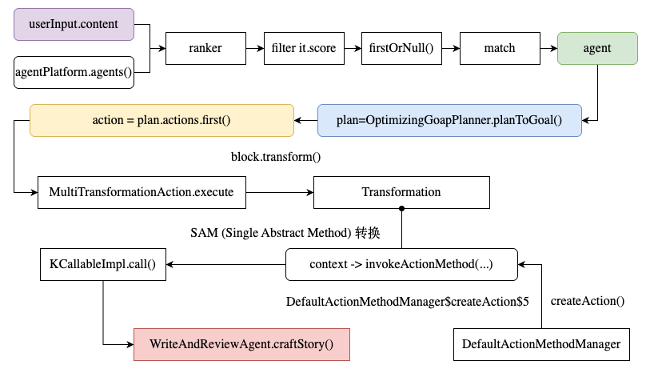

# Embabel 框架深度原理分析

> - 测试案例: "Tell me a story about Tom and Jerry"
> - 执行时间: 2025-11-10 19:50:50 - 19:51:01 (总计 11秒)

---

## 关键组件

| 组件 | 职责 | 实现类 | 包名 | 库名 |
|:-----|:-----|:-------|:-----|:-----|
| Shell | 用户交互入口 | `ShellCommands` | `com.embabel.agent.shell` | embabel-agent-shell-0.1.4.jar |
| Autonomy | Agent 选择与执行协调 | `Autonomy` | `com.embabel.agent.api.common.autonomy` | embabel-agent-api-0.1.4.jar |
| Process | 进程生命周期管理 | `SimpleAgentProcess` | `com.embabel.agent.core.support` | embabel-agent-api-0.1.4.jar |
| Planner | GOAP 规划算法 | `GoapPlanner` | `com.embabel.plan.goap` | embabel-agent-api-0.1.4.jar |
| ActionRunner | Action 执行与计时 | `ActionRunner` | `com.embabel.agent.core` | embabel-agent-api-0.1.4.jar |
| ActionManager | 方法调用管理 | `DefaultActionMethodManager` | `com.embabel.agent.api.annotation.support` | embabel-agent-api-0.1.4.jar |
| AIContext | AI 服务访问 | `OperationContext` | `com.embabel.agent.api.common` | embabel-agent-api-0.1.4.jar |
| LLM Client | LLM 调用 | `ChatClientLlmOperations` | `com.embabel.agent.spi.support.springai` | embabel-agent-api-0.1.4.jar |

---

## 调用堆栈

基于 `doc/*stack*.txt` 的 craftStory 调用堆栈:

```
Ollama (qwen2.5:latest)
     ↑
ChatClientLlmOperations (LLM 客户端)
     ↑
OperationContext (AI 服务)
     ↑
WriteAndReviewAgent.craftStory()           ← 业务逻辑 (java:139)
     ↑
-------     
Method.invoke(obj, args) -> DirectMethodHandleAccessor.invoke()          ← Java 反射
     ↑
KCallableImpl.call() -> CallerImpl.callMethod(args[0], args.dropFirst())               ← Kotlin 反射 (kt:107)
     ↑
invokeActionMethodKotlinReflect(method, kFunction, instance, actionContext) -> kFunction.call(*args)
     ↑
DefaultActionMethodManager.createAction(method, instance) -> invokeActionMethod(method, instance, actionContext)  ← 方法管理
------- 
block.transform(
    TransformationActionContext(
        input = inputValues,
        processContext = processContext,
        inputClass = List::class.java as Class<List<Any>>,
        outputClass = outputClass,
        action = this,
    )
)
     ↑
ActionRunner.execute(processContext) -> MultiTransformationAction.execute(processContext) ← 执行器 (kt:50)
     ↑
RetryTemplate.doExecute()                  ← 重试机制
     ↑
AbstractAgentProcess.executeAction(action) -> action.execute(processContext = processContext)
     ↑  
AbstractAgentProcess.run() -> tick() -> SimpleAgentProcess.formulateAndExecutePlan(worldState)      ← 进程执行  
 -> Planner.bestValuePlanToAnyGoal(system = agent.planningSystem) -> Planner.plansToGoals(system) -> OptimizingGoapPlanner.planToGoal(actions, goal) 
 -> AStarGoapPlanner.planToGoalFrom(startState, actions, goal)    ← A*_search_algorithm
 -> action = plan.actions.first()
     ↑
Autonomy.chooseAndRunAgent() -> runAgent()                        ← 协调层
     ↑
ShellCommands.execute() -> executeIntent() -> runProcess()                 ← Shell 入口 (kt:322)
     ↑
用户输入query
```

### 关键链路



在 `MultiTransformationAction.execute()` 方法中，`block.transform()` 是如何走到 `DefaultActionMethodManager.createAction()` 的？

`block` 是 `Transformation` 类型的实例，但 `DefaultActionMethodManager` 和 `Transformation` 并没有直接的继承或实现关系。

通过 Kotlin 的 **SAM (Single Abstract Method) 转换**，lambda 表达式被自动转换为函数式接口的实现。

#### 1. Transformation 是函数式接口

```kotlin
// Transformation.kt
fun interface Transformation<I, O> {
    fun transform(context: TransformationActionContext<I, O>): O?
}
```

`fun interface` 关键字表示这是一个**函数式接口**（SAM 类型），只有一个抽象方法 `transform()`。

#### 2. MultiTransformationAction 持有 Transformation 对象

```kotlin
// TransformationAction.kt (与 MultiTransformationAction 同为 AbstractAction 的子类)
open class TransformationAction<I, O>(
    // ... 其他参数
    private val block: Transformation<I, O>,  // ← 持有 Transformation 对象
) : AbstractAction(...) {
    
    override fun execute(processContext: ProcessContext): ActionStatus = 
        ActionRunner.execute(processContext) {
            val input = processContext.getValue(inputVarName, inputClass.name) as I
            val output = block.transform(  // ← 调用 Transformation.transform()
                TransformationActionContext(
                    input = input,
                    processContext = processContext,
                    action = this,
                    inputClass = inputClass,
                    outputClass = outputClass,
                )
            )
            // ... 处理输出
        }
}
```

#### 3. DefaultActionMethodManager.createAction() 传入 Lambda

```kotlin
// DefaultActionMethodManager.kt (第 73-90 行)
override fun createAction(
    method: Method,
    instance: Any,
    toolCallbacksOnInstance: List<ToolCallback>,
): Action {
    // ... 解析参数和注解
    
    return MultiTransformationAction(
        name = nameGenerator.generateName(instance, method.name),
        description = actionAnnotation.description.ifBlank { method.name },
        // ... 其他参数
    ) { context ->  // ← 第 85 行：Lambda 表达式
        invokeActionMethod(
            method = method,
            instance = instance,
            actionContext = context,
        )
    }
}
```

**关键点**:
- 第 85 行的 lambda `{ context -> invokeActionMethod(...) }` 被传给 `MultiTransformationAction` 构造函数
- 由于 `Transformation` 是函数式接口，Kotlin 编译器自动将 lambda 转换为 `Transformation` 的实现
- 这个 lambda 在编译后生成匿名内部类：`DefaultActionMethodManager$createAction$5`

#### 4. 完整调用链

```
MultiTransformationAction.execute()
  └─ block.transform(context)
      ↓
      [block 是 Transformation 接口的实例]
      [实际上是 DefaultActionMethodManager.createAction() 中的 lambda]
      ↓
      Lambda 内部代码执行：
      └─ invokeActionMethod(method, instance, actionContext)
          └─ invokeActionMethodKotlinReflect(method, kFunction, instance, actionContext)
              └─ kFunction.call(*args)  // Kotlin 反射
                  └─ Method.invoke()  // Java 反射
                      └─ WriteAndReviewAgent.craftStory()  // 实际业务方法
```

#### 5. 关键技术点

| 技术 | 说明 |
|:-----|:-----|
| **SAM 转换** | Kotlin 自动将 lambda 转换为函数式接口的实现 |
| **Lambda 表达式** | `{ context -> invokeActionMethod(...) }` 是一个闭包，捕获了 `method` 和 `instance` |
| **匿名内部类** | 编译后生成 `DefaultActionMethodManager$createAction$5` |
| **适配器模式** | Lambda 将反射调用适配为 `Transformation` 接口 |
| **命令模式** | 将方法调用封装为对象（`Transformation`），延迟执行 |

#### 6. 为什么这样设计？

1. **解耦**：`MultiTransformationAction` 不需要知道具体的方法调用细节
2. **灵活性**：可以传入任何符合 `Transformation` 接口的实现
3. **延迟执行**：方法调用被封装为对象，在 `execute()` 时才真正执行
4. **类型安全**：通过泛型保证输入输出类型的正确性
5. **简洁性**：使用 lambda 表达式比手动创建匿名类更简洁

## 详细执行流程

### 阶段 1: Agent 选择 (4.99秒)

```
19:50:50.068  ShellCommands.execute()
              └─ 创建 UserInput(content="Tell me a story about Tom and Jerry",
                                timestamp=2025-11-10T11:50:50.068805Z)

19:50:50.068  Autonomy.chooseAndRunAgent()
              └─ Agent Selector 调用 LLM 分析用户意图
                 ├─ 创建 DummyInstance for RankingsResponse
                 ├─ LLM 调用 (459 prompt + 19 completion tokens)
                 └─ 返回: {"rankings":[{"name":"WriteAndReviewAgent", "confidence":1.0}]}

19:50:55.061  选中 WriteAndReviewAgent
              └─ 扫描 Agent 元数据:
                 ├─ craftStory: UserInput → Story
                 ├─ reviewStory: UserInput,Story → ReviewedStory (Goal)
                 └─ 构建 Action 依赖图
```

**Agent 元数据** (基于日志):

```
WriteAndReviewAgent:
  description: "Generate a story based on user input and review it"
  provider: com.embabel.template.agent
  version: 0.1.0-SNAPSHOT
  
  goals:
    - reviewStory (目标 Action)
      preconditions:
        hasRun_reviewStory: FALSE
        it:UserInput: TRUE
        it:Story: TRUE
        it:ReviewedStory: FALSE
      postconditions:
        hasRun_reviewStory: TRUE
        it:ReviewedStory: TRUE
  
  actions:
    - craftStory
      preconditions:
        hasRun_craftStory: FALSE
        it:UserInput: TRUE
        it:Story: FALSE
      postconditions:
        hasRun_craftStory: TRUE
        it:Story: TRUE
    
    - reviewStory (同上)
```

### 阶段 2: GOAP 规划 (0.024秒)

```
19:50:55.061  创建 Process: relaxed_moore
              └─ Blackboard ID: b986b939-16b3-4018-9176-b9cd4b1423a3

19:50:55.077  初始化世界状态:
              {
                it:UserInput: TRUE,
                it:Story: FALSE,
                it:ReviewedStory: FALSE,
                hasRun_craftStory: FALSE,
                hasRun_reviewStory: FALSE
              }

19:50:55.085  GOAP Planner 执行 A* 搜索:
              ├─ 目标: ReviewedStory=TRUE
              ├─ 分析可执行 Actions:
              │  ├─ craftStory: 前置条件满足 ✓ (UserInput=TRUE)
              │  └─ reviewStory: 前置条件不满足 ✗ (缺少 Story)
              └─ 生成计划: [craftStory → reviewStory]
                 cost: 0.0, netValue: 0.0
```

**日志输出**:

```
[relaxed_moore] Formulated plan:
  com.embabel.template.agent.WriteAndReviewAgent.craftStory ->
    com.embabel.template.agent.WriteAndReviewAgent.reviewStory
  goal: com.embabel.template.agent.WriteAndReviewAgent.reviewStory
  cost: 0.0
  netValue: 0.0
```

### 阶段 3: 执行 craftStory (3.16秒)

```
19:50:55.085  SimpleAgentProcess.formulateAndExecutePlan()
              └─ 执行 Action: craftStory

19:50:55.086  ActionRunner.execute()
              ├─ 延迟调度: PT0S (立即执行)
              └─ 输出类型: JvmType(className=WriteAndReviewAgent$Story)

19:50:55.086  DefaultActionMethodManager.invokeActionMethod()
              ├─ 解析输入: [UserInput(...)]
              └─ 使用 Kotlin Reflection 调用

19:50:55.086  WriteAndReviewAgent.craftStory() 开始执行
              ├─ 构建 Prompt:
              │  "Craft a short story in 100 words or less.
              │   The story should be engaging and imaginative.
              │   Use the user's input as inspiration if possible.
              │   
              │   # User input
              │   Tell me a story about Tom and Jerry"
              │
              ├─ 配置 LLM:
              │  ├─ Model: qwen2.5:latest
              │  ├─ Temperature: 0.7 (高温度，增加创意)
              │  └─ Persona: WRITER ("Creative Storyteller")
              │
              └─ 调用 ChatClientLlmOperations.createObject()

[LLM 调用中... 耗时 3.16秒]

19:50:58.243  LLM 返回 Story 对象:
              Story[text="Tom and Jerry found themselves in a magical circus 
                          where the acts were orchestrated by fairy tales. In the 
                          moonlit ring, Tom played the brave knight, chasing shadows 
                          that turned into fearsome dragons. Jerry, clever as ever, 
                          rode tiny unicorns, leaving trails of glittering stardust. 
                          Together, they faced enchanted forests and solved riddles 
                          to find a hidden treasure chest filled with stories, each 
                          one more fantastical than the last."]

19:50:58.243  绑定输出到 Blackboard:
              ├─ 键: "it"
              └─ 值: Story 对象

19:50:58.243  craftStory 执行完成
              └─ 耗时: PT3.157S
```

**世界状态更新**:

```
执行前: {UserInput=TRUE, Story=FALSE, ReviewedStory=FALSE, hasRun_craftStory=FALSE}
执行后: {UserInput=TRUE, Story=TRUE,  ReviewedStory=FALSE, hasRun_craftStory=TRUE}
```

**Blackboard 更新**:

```
id: 27283519-de42-4807-9fa2-d506bd916876
map:
  it = Story[text="In a bustling circus..."]
entries:
  - UserInput(content="Tell me a story about Tom and Jerry", ...)
  - Story[text="In a bustling circus..."]
```

### 阶段 4: 动态重规划 (0.011秒)

```
19:50:58.243  检查当前状态:
              {
                it:UserInput: TRUE,
                it:Story: TRUE,          ← 新增
                it:ReviewedStory: FALSE,
                hasRun_craftStory: TRUE, ← 已执行
                hasRun_reviewStory: FALSE
              }

19:50:58.254  GOAP Planner 重新规划:
              ├─ 分析 reviewStory 前置条件:
              │  ├─ UserInput: TRUE ✓
              │  ├─ Story: TRUE ✓
              │  └─ hasRun_reviewStory: FALSE ✓
              ├─ 前置条件满足，可以执行
              └─ 生成新计划: [reviewStory]
                 cost: 0.0, netValue: 0.0
```

**日志输出**:

```
[relaxed_moore] Formulated plan:
  com.embabel.template.agent.WriteAndReviewAgent.reviewStory
  goal: com.embabel.template.agent.WriteAndReviewAgent.reviewStory
  cost: 0.0
  netValue: 0.0
from:
  hasRun_reviewStory: FALSE
  it:ReviewedStory: FALSE
  hasRun_craftStory: TRUE
  it:UserInput: TRUE
  it:Story: TRUE
```

### 阶段 5: 执行 reviewStory (3.18秒)

```
19:50:58.254  SimpleAgentProcess.formulateAndExecutePlan()
              └─ 执行 Action: reviewStory

19:50:58.254  DefaultActionMethodManager.invokeActionMethod()
              ├─ 解析输入: [UserInput(...), Story[...]]
              └─ 使用 Kotlin Reflection 调用

19:50:58.254  WriteAndReviewAgent.reviewStory() 开始执行
              ├─ 构建 Prompt:
              │  "You will be given a short story to review.
              │   Review it in 100 words or less.
              │   Consider whether or not the story is engaging, imaginative, 
              │   and well-written.
              │   
              │   # Story
              │   Tom and Jerry found themselves in a magical circus...
              │   
              │   # User input that inspired the story
              │   Tell me a story about Tom and Jerry"
              │
              ├─ 配置 LLM:
              │  ├─ Model: qwen2.5:latest
              │  ├─ Temperature: 默认 (0.5)
              │  └─ Persona: REVIEWER ("New York Times Book Reviewer")
              │
              └─ 调用 ChatClientLlmOperations.generateText()

[LLM 调用中... 耗时 3.18秒]

19:51:01.434  LLM 返回评审文本:
              "This whimsical tale of Tom and Jerry in a magical circus is 
               both engaging and imaginative. The dynamic between the two 
               characters remains intact—Tom as the intrepid hero and Jerry 
               as the clever sidekick—while introducing a new, fairy-tale-
               infused setting that keeps the spirit of adventure alive. The 
               story's fantastical elements are woven seamlessly into familiar 
               scenarios, making it delightful for all ages. A perfect read 
               for anyone who cherishes the classic duo in a fresh, enchanting 
               setting."

19:51:01.434  创建 ReviewedStory 对象:
              ReviewedStory[
                story=Story[text="Tom and Jerry found themselves..."],
                review="This whimsical tale of Tom and Jerry...",
                reviewer=Persona(name="Media Book Review",
                                persona="New York Times Book Reviewer",
                                voice="Professional and insightful",
                                objective="Help guide readers toward good stories")
              ]

19:51:01.434  绑定输出到 Blackboard:
              ├─ 键: "it"
              └─ 值: ReviewedStory 对象

19:51:01.434  reviewStory 执行完成
              └─ 耗时: PT3.18S
```

**世界状态更新**:

```
执行前: {UserInput=TRUE, Story=TRUE, ReviewedStory=FALSE, hasRun_reviewStory=FALSE}
执行后: {UserInput=TRUE, Story=TRUE, ReviewedStory=TRUE,  hasRun_reviewStory=TRUE}
```

### 阶段 6: 目标验证与完成 (0.009秒)

```
19:51:01.434  GOAP Planner 最终验证:
              ├─ 当前状态:
              │  {
              │    it:UserInput: TRUE,
              │    it:Story: TRUE,
              │    it:ReviewedStory: TRUE,  ← 目标对象存在
              │    hasRun_craftStory: TRUE,
              │    hasRun_reviewStory: TRUE
              │  }
              ├─ 目标状态: ReviewedStory=TRUE
              └─ 目标达成 ✓

19:51:01.443  Process 完成:
              ├─ 总耗时: PT6.373S (6.37秒)
              ├─ Actions 执行: 2 (craftStory, reviewStory)
              ├─ 规划次数: 2 (初始 + 1次重规划)
              └─ LLM 调用: 3次 (Agent选择 + 2个Action)
```

**最终 Blackboard**:

```
id: b986b939-16b3-4018-9176-b9cd4b1423a3
map:
  it = ReviewedStory[
    story=Story[text="Tom and Jerry found themselves in a magical circus..."],
    review="This whimsical tale of Tom and Jerry in a magical circus...",
    reviewer=Persona(name="Media Book Review", ...)
  ]
entries:
  - UserInput(content="Tell me a story about Tom and Jerry", ...)
  - Story[text="Tom and Jerry found themselves in a magical circus..."]
  - ReviewedStory[...]
```

### 阶段 7: 结果格式化与输出

基于 `doc/stack3.txt` 的调用堆栈:

```
ShellCommands.runProcess()
└─ FormatProcessOutputKt.formatProcessOutput() ← formatProcessOutput.kt:41
   └─ ReviewedStory.getContent() ← WriteAndReviewAgent.java:74
      └─ String.format() 生成 Markdown 格式
```

**输出内容**:

```
You asked: UserInput(content=Tell me a story about Tom and Jerry, ...)

# Story
Tom and Jerry found themselves in a magical circus where the acts were 
orchestrated by fairy tales. In the moonlit ring, Tom played the brave 
knight, chasing shadows that turned into fearsome dragons. Jerry, clever 
as ever, rode tiny unicorns, leaving trails of glittering stardust. 
Together, they faced enchanted forests and solved riddles to find a 
hidden treasure chest filled with stories, each one more fantastical 
than the last.

# Review
This whimsical tale of Tom and Jerry in a magical circus is both engaging 
and imaginative. The dynamic between the two characters remains intact—Tom 
as the intrepid hero and Jerry as the clever sidekick—while introducing a 
new, fairy-tale-infused setting that keeps the spirit of adventure alive. 
The story's fantastical elements are woven seamlessly into familiar 
scenarios, making it delightful for all ages. A perfect read for anyone 
who cherishes the classic duo in a fresh, enchanting setting.

# Reviewer
Media Book Review, Monday, November 10, 2025

LLMs used: [qwen2.5:latest] across 3 calls
Prompt tokens: 459 (Agent选择) + 估算 (craftStory + reviewStory)
Completion tokens: 19 (Agent选择) + 估算 (craftStory + reviewStory)
Cost: $0.0000

Tool usage: (none)
```
